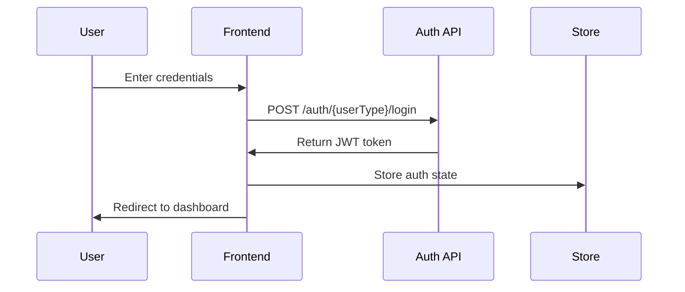
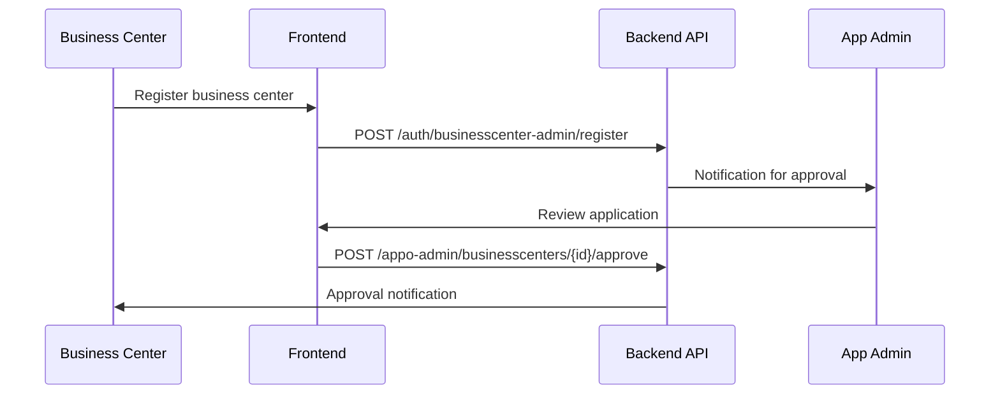
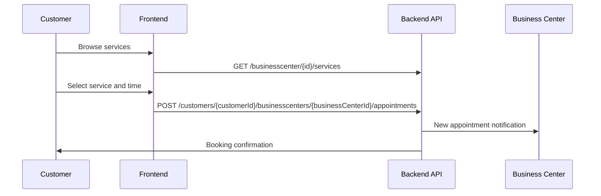

# Appo Frontend - API Integration Mapping

## 1. API Endpoint Overview

Based on the provided API endpoints, this document maps frontend features to corresponding backend APIs.

### 1.1 API Base Structure
```
Base URL: {API_BASE_URL}
Authentication: Bearer Token (JWT)
Content-Type: application/json
```

## 2. Authentication & User Management APIs

### 2.1 App Admin Authentication
| Frontend Feature | API Endpoint | HTTP Method | Frontend Component |
|------------------|--------------|-------------|-------------------|
| App Admin Login | `/auth/appo-admin/login` | POST | LoginPage (App Admin) |
| App Admin Registration | `/auth/appo-admin/register` | POST | RegisterPage (App Admin) |

**Frontend Implementation:**
```typescript
// services/authAPI.ts
export const authAPI = {
  loginAppAdmin: (credentials: LoginCredentials) => 
    api.post('/auth/appo-admin/login', credentials),
  
  registerAppAdmin: (data: RegistrationData) => 
    api.post('/auth/appo-admin/register', data),
};

// Usage in components
const AdminLoginForm = () => {
  const handleLogin = async (credentials) => {
    await authAPI.loginAppAdmin(credentials);
  };
};
```

### 2.2 Business Center Admin Authentication
| Frontend Feature | API Endpoint | HTTP Method | Frontend Component |
|------------------|--------------|-------------|-------------------|
| Business Center Admin Login | `/auth/businesscenter-admin/login` | POST | LoginPage (BC Admin) |
| Business Center Admin Registration | `/auth/businesscenter-admin/register` | POST | RegisterPage (BC Admin) |

### 2.3 Customer Authentication
| Frontend Feature | API Endpoint | HTTP Method | Frontend Component |
|------------------|--------------|-------------|-------------------|
| Customer Login | `/auth/customers/login` | POST | LoginPage (Customer) |
| Customer Registration | `/auth/customers/register` | POST | RegisterPage (Customer) |

## 3. Business Center Management APIs

### 3.1 Business Center Operations (App Admin)
| Frontend Feature | API Endpoint | HTTP Method | Frontend Component |
|------------------|--------------|-------------|-------------------|
| Approve Business Center | `/appo-admin/businesscenters/{businessCenterId}/approve` | POST | BusinessCenterApprovalPage |
| Cancel Business Center | `/appo-admin/businesscenters/{businessCenterId}/cancel` | POST | BusinessCenterManagement |
| List Business Centers | `/appo-admin/businesscenters/{businessCenterId}/attachments/{attachmentId}/approve` | POST | BusinessCenterList |
| Reject Business Center Attachment | `/appo-admin/businesscenters/{businessCenterId}/attachments/{attachmentId}/reject` | POST | AttachmentReview |

**Frontend Implementation:**
```typescript
// components/admin/BusinessCenterApproval.tsx
const BusinessCenterApproval = () => {
  const handleApprove = async (businessCenterId: string) => {
    await businessCenterAPI.approve(businessCenterId);
    // Refresh list and show success notification
  };

  const handleCancel = async (businessCenterId: string) => {
    await businessCenterAPI.cancel(businessCenterId);
    // Update UI state
  };
};
```

### 3.2 Business Center Admin Operations
| Frontend Feature | API Endpoint | HTTP Method | Frontend Component |
|------------------|--------------|-------------|-------------------|
| Manage Business Centers | `/businesscenter-admin/{adminId}/businesscenters` | DELETE | BusinessCenterAdminDashboard |
| Get Business Centers | `/businesscenter-admin/{adminId}/businesscenters/{businessCenterId}` | GET | BusinessCenterProfile |

## 4. Staff Management APIs

### 4.1 Business Center Staff Operations
| Frontend Feature | API Endpoint | HTTP Method | Frontend Component |
|------------------|--------------|-------------|-------------------|
| Add Staff | `/businesscenter/{businessCenterId}/staff` | POST | StaffManagement |
| Delete Staff | `/businesscenter/{businessCenterId}/staff/{staffId}` | DELETE | StaffList |
| Get Staff Availability | `/businesscenter/{businessCenterId}/staff/{staffId}/availability` | GET | StaffSchedule |

**Frontend Implementation:**
```typescript
// components/business-admin/StaffManagement.tsx
const StaffManagement = () => {
  const [staff, setStaff] = useState<Staff[]>([]);
  
  const addStaff = async (staffData: CreateStaffData) => {
    const response = await staffAPI.create(businessCenterId, staffData);
    setStaff(prev => [...prev, response.data]);
  };

  const removeStaff = async (staffId: string) => {
    await staffAPI.delete(businessCenterId, staffId);
    setStaff(prev => prev.filter(s => s.id !== staffId));
  };
};
```

## 5. Service Management APIs

### 5.1 Service Operations
| Frontend Feature | API Endpoint | HTTP Method | Frontend Component |
|------------------|--------------|-------------|-------------------|
| Create Service | `/businesscenter/{businessCenterId}/services` | POST | ServiceForm |
| Delete Service | `/businesscenter/{businessCenterId}/services/{serviceId}` | DELETE | ServiceManagement |
| Get Services | `/businesscenter/{businessCenterId}/services` | GET | ServiceList |
| Start Service | `/businesscenter/{businessCenterId}/services/{serviceId}/start` | POST | ServiceDelivery |
| End Service | `/businesscenter/{businessCenterId}/services/{serviceId}/end` | POST | ServiceCompletion |

**Frontend Implementation:**
```typescript
// components/services/ServiceManagement.tsx
const ServiceManagement = () => {
  const { services, loading } = useServices(businessCenterId);
  
  const handleServiceStart = async (serviceId: string) => {
    await serviceAPI.start(businessCenterId, serviceId);
    // Update service status in UI
  };

  const handleServiceEnd = async (serviceId: string) => {
    await serviceAPI.end(businessCenterId, serviceId);
    // Mark service as completed
  };
};
```

## 6. Appointment Management APIs

### 6.1 Appointment Operations
| Frontend Feature | API Endpoint | HTTP Method | Frontend Component |
|------------------|--------------|-------------|-------------------|
| Create Appointment | `/businesscenter/{businessCenterId}/appointments` | POST | AppointmentBooking |
| Delete Appointment | `/businesscenter/{businessCenterId}/appointments/{appointmentId}` | DELETE | AppointmentManagement |
| Upload Attachment | `/businesscenter/{businessCenterId}/attachments` | POST | FileUpload |
| Download Attachment | `/businesscenter/{businessCenterId}/attachments/{attachmentId}` | DELETE | AttachmentViewer |

### 6.2 Customer Appointment Operations
| Frontend Feature | API Endpoint | HTTP Method | Frontend Component |
|------------------|--------------|-------------|-------------------|
| Book Appointment | `/customers/{customerId}/businesscenters/{businessCenterId}/appointments` | POST | CustomerBooking |
| Cancel Appointment | `/customers/{customerId}/appointments/{appointmentId}` | DELETE | CustomerAppointments |
| Get Appointments | `/customers/{customerId}/appointments` | GET | CustomerDashboard |

**Frontend Implementation:**
```typescript
// components/customer/AppointmentBooking.tsx
const AppointmentBooking = () => {
  const [selectedService, setSelectedService] = useState<Service | null>(null);
  const [availableSlots, setAvailableSlots] = useState<TimeSlot[]>([]);

  const bookAppointment = async (bookingData: BookingData) => {
    const response = await appointmentAPI.create(customerId, businessCenterId, bookingData);
    // Show confirmation and redirect
  };

  const cancelAppointment = async (appointmentId: string) => {
    await appointmentAPI.cancel(customerId, appointmentId);
    // Update appointments list
  };
};
```

## 7. Data Flow Architecture

### 7.1 Authentication Flow


### 7.2 Business Center Approval Flow


### 7.3 Appointment Booking Flow


## 8. Error Handling Strategy

### 8.1 API Error Mapping
```typescript
export const handleAPIError = (error: AxiosError) => {
  const errorMap = {
    400: 'Invalid request data',
    401: 'Authentication required',
    403: 'Access denied',
    404: 'Resource not found',
    409: 'Conflict - resource already exists',
    422: 'Validation error',
    500: 'Internal server error',
  };

  const status = error.response?.status;
  const message = errorMap[status] || 'An unexpected error occurred';
  
  return {
    status,
    message,
    details: error.response?.data,
  };
};
```

### 8.2 Retry Strategy
```typescript
const apiWithRetry = axios.create({
  timeout: 10000,
});

apiWithRetry.interceptors.response.use(
  (response) => response,
  async (error) => {
    const config = error.config;
    
    if (config.retryCount < 3 && error.response?.status >= 500) {
      config.retryCount = config.retryCount || 0;
      config.retryCount++;
      
      await new Promise(resolve => setTimeout(resolve, 1000 * config.retryCount));
      return apiWithRetry(config);
    }
    
    return Promise.reject(error);
  }
);
```

## 9. Real-time Features Integration

### 9.1 WebSocket Events
```typescript
// Real-time notifications for appointment updates
const useAppointmentNotifications = () => {
  useEffect(() => {
    const ws = new WebSocket(`${WS_URL}/appointments`);
    
    ws.onmessage = (event) => {
      const notification = JSON.parse(event.data);
      dispatch(addNotification(notification));
    };
    
    return () => ws.close();
  }, []);
};
```

### 9.2 Push Notifications
```typescript
// Service worker for push notifications
self.addEventListener('push', (event) => {
  const options = {
    body: event.data.text(),
    icon: '/icon-192x192.png',
    badge: '/badge-72x72.png',
    actions: [
      { action: 'view', title: 'View Appointment' },
      { action: 'dismiss', title: 'Dismiss' }
    ]
  };
  
  event.waitUntil(
    self.registration.showNotification('Appo Notification', options)
  );
});
```

## 10. Performance Optimization

### 10.1 API Response Caching
```typescript
// React Query for server state management
const useBusinessCenters = (params: BusinessCenterParams) => {
  return useQuery({
    queryKey: ['businesscenters', params],
    queryFn: () => businessCenterAPI.getAll(params),
    staleTime: 5 * 60 * 1000, // 5 minutes
    cacheTime: 10 * 60 * 1000, // 10 minutes
  });
};
```

### 10.2 Optimistic Updates
```typescript
const useCreateAppointment = () => {
  const queryClient = useQueryClient();
  
  return useMutation({
    mutationFn: appointmentAPI.create,
    onMutate: async (newAppointment) => {
      // Optimistically update the UI
      await queryClient.cancelQueries(['appointments']);
      const previousAppointments = queryClient.getQueryData(['appointments']);
      
      queryClient.setQueryData(['appointments'], old => [...old, newAppointment]);
      
      return { previousAppointments };
    },
    onError: (err, newAppointment, context) => {
      // Rollback on error
      queryClient.setQueryData(['appointments'], context.previousAppointments);
    },
    onSettled: () => {
      // Refetch to ensure consistency
      queryClient.invalidateQueries(['appointments']);
    },
  });
};
```

This API integration mapping provides a comprehensive guide for implementing frontend features with the corresponding backend endpoints, ensuring proper data flow and error handling throughout the application. 