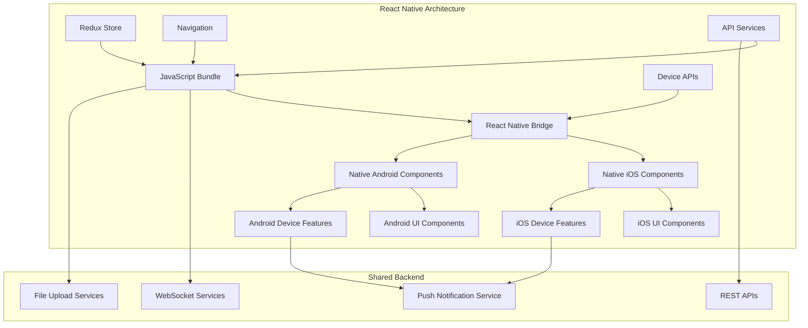
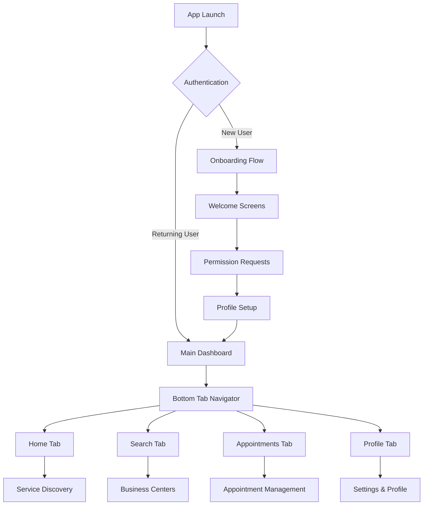
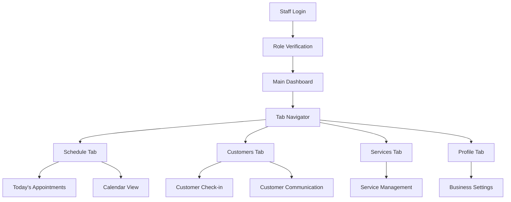

# Appo Mobile Application - High-Level Design

## 1. Overview
The Appo Mobile Application is a React Native cross-platform mobile solution that provides a native mobile experience for the appointment scheduling platform. It serves customers and business center staff with optimized mobile workflows, offline capabilities, and device-specific features.

## 2. Mobile Application Architecture

### 2.1 React Native Architecture Overview



### 2.2 Mobile-Specific Architecture Pattern
- **Architecture**: Cross-platform React Native with platform-specific optimizations
- **State Management**: Redux Toolkit with React Native AsyncStorage persistence
- **Navigation**: React Navigation v6 with stack and tab navigators
- **UI Framework**: React Native Elements with custom design system
- **Device Integration**: Native modules for camera, location, notifications, and biometrics

### 2.3 Application Structure
```
src/
├── components/          # Reusable mobile components
├── screens/            # Screen components organized by user role
├── navigation/         # Navigation configuration
├── store/             # Redux store with persistence
├── services/          # API and device services
├── hooks/             # Custom React Native hooks
├── utils/             # Utility functions
├── constants/         # App constants and configurations
├── types/             # TypeScript type definitions
├── assets/            # Images, fonts, and static assets
├── localization/      # Multi-language support
└── native/            # Platform-specific native modules
```

## 3. Target User Personas

### 3.1 Primary Users (Customer App)
- **Mobile-First Customers**: Users who prefer mobile booking and management
- **On-the-Go Professionals**: Business travelers needing quick appointment access
- **Young Demographics**: Tech-savvy users expecting modern mobile UX

### 3.2 Secondary Users (Business Staff App)
- **Service Providers**: Staff members managing appointments on mobile
- **Business Owners**: Monitoring business performance on mobile
- **Reception Staff**: Check-in and customer management on tablets

## 4. Core Mobile Features

### 4.1 Customer Mobile App Features

#### 4.1.1 Enhanced Discovery & Booking
- **Location-Based Search**: Find nearby business centers using GPS
- **Visual Service Browsing**: Image-rich service catalogs with swipe gestures
- **Quick Booking**: Streamlined booking flow optimized for mobile
- **Voice Search**: Voice-to-text service search functionality
- **AR Preview**: Augmented reality preview of business locations (future)

#### 4.1.2 Mobile-Optimized Management
- **Appointment Dashboard**: Card-based interface with quick actions
- **Smart Notifications**: Push notifications with rich content and actions
- **Offline Mode**: View appointments and basic info without internet
- **Digital Wallet Integration**: Apple Pay, Google Pay integration
- **QR Code Check-in**: Contactless check-in using QR codes

#### 4.1.3 Enhanced User Experience
- **Biometric Authentication**: Face ID, Touch ID, and fingerprint login
- **Dark Mode Support**: System-responsive dark/light themes
- **Haptic Feedback**: Tactile feedback for important actions
- **Gesture Navigation**: Swipe-to-delete, pull-to-refresh patterns
- **Voice Assistants**: Siri Shortcuts and Google Assistant integration

### 4.2 Business Staff Mobile App Features

#### 4.2.1 Appointment Management
- **Mobile Schedule View**: Optimized calendar for small screens
- **Quick Actions**: Swipe gestures for appointment status updates
- **Customer Communication**: In-app messaging and calling
- **Service Delivery Tracking**: Timer and progress tracking tools
- **Offline Data Sync**: Work offline with automatic sync when online

#### 4.2.2 Business Operations
- **Check-in Management**: Tablet-optimized check-in interface
- **Resource Management**: Real-time availability updates
- **Performance Metrics**: Mobile-friendly analytics dashboard
- **Staff Coordination**: Team messaging and schedule coordination
- **Emergency Alerts**: Critical notification system for urgent issues

## 5. Mobile User Experience Design

### 5.1 Design Principles

#### 5.1.1 Mobile-First Design
- **Touch-Optimized Interface**: Minimum 44pt touch targets
- **Thumb-Friendly Navigation**: Bottom navigation and reachable controls
- **Gesture-Based Interactions**: Intuitive swipe, pinch, and tap gestures
- **Context-Aware UI**: Smart defaults based on location and time

#### 5.1.2 Performance-Focused
- **Fast Loading**: Optimized images and lazy loading
- **Smooth Animations**: 60fps animations with native driver
- **Memory Efficient**: Optimized list rendering with FlatList
- **Battery Conscious**: Efficient background processing

#### 5.1.3 Accessibility
- **Screen Reader Support**: VoiceOver and TalkBack compatibility
- **High Contrast Mode**: Enhanced visibility options
- **Dynamic Type Support**: Adjustable font sizes
- **Voice Control**: Voice navigation support

### 5.2 Navigation Patterns

#### 5.2.1 Customer App Navigation


#### 5.2.2 Business Staff App Navigation


## 6. Technology Stack

### 6.1 Core Technologies
- **Framework**: React Native 0.72+
- **Language**: TypeScript for type safety
- **Build Tools**: Metro bundler with custom configurations
- **Development**: Expo CLI for development workflow

### 6.2 UI/UX Libraries
- **Component Library**: React Native Elements + Custom Design System
- **Navigation**: React Navigation v6
- **Animations**: React Native Reanimated v3
- **Gestures**: React Native Gesture Handler
- **Icons**: React Native Vector Icons
- **Charts**: Victory Native for data visualization

### 6.3 State Management
- **Global State**: Redux Toolkit
- **Persistence**: Redux Persist with AsyncStorage
- **Server State**: React Query (TanStack Query)
- **Form State**: React Hook Form

### 6.4 Device Integration
- **Camera**: React Native Image Picker
- **Location**: React Native Geolocation Service
- **Notifications**: React Native Push Notification
- **Biometrics**: React Native Biometrics
- **Storage**: React Native AsyncStorage
- **Network**: React Native NetInfo

### 6.5 Platform-Specific
- **iOS**: Native modules for iOS-specific features
- **Android**: Native modules for Android-specific features
- **Code Push**: Microsoft CodePush for OTA updates
- **Crash Reporting**: Sentry for error tracking

## 7. Mobile-Specific Features

### 7.1 Offline Capabilities
- **Data Synchronization**: Offline-first architecture with sync
- **Cached Content**: Essential data cached for offline access
- **Queue System**: Actions queued for execution when online
- **Conflict Resolution**: Smart merge strategies for data conflicts

### 7.2 Push Notifications
- **Rich Notifications**: Images, actions, and deep linking
- **Personalized Content**: User-specific notification preferences
- **Silent Updates**: Background data refresh
- **Local Notifications**: Appointment reminders and alerts

### 7.3 Device Features Integration
- **Camera Integration**: Photo capture for service documentation
- **GPS Location**: Automatic location detection and directions
- **Biometric Security**: Secure authentication options
- **Calendar Integration**: Sync with device calendar
- **Contact Integration**: Quick contact access for businesses

### 7.4 Performance Optimizations
- **Image Optimization**: WebP format with fallbacks
- **Bundle Splitting**: Platform-specific bundles
- **Lazy Loading**: Screen and component lazy loading
- **Memory Management**: Efficient image and data caching

## 8. Security Considerations

### 8.1 Mobile Security
- **Secure Storage**: Encrypted storage for sensitive data
- **Certificate Pinning**: API communication security
- **Root/Jailbreak Detection**: Enhanced security for compromised devices
- **Biometric Authentication**: Secure user authentication
- **App Transport Security**: Enforced HTTPS communication

### 8.2 Data Protection
- **Local Encryption**: Sensitive data encryption at rest
- **Secure Transmission**: End-to-end encryption for communications
- **Privacy Controls**: Granular permission management
- **Data Minimization**: Only store necessary data locally

## 9. Platform-Specific Considerations

### 9.1 iOS Optimizations
- **Human Interface Guidelines**: Native iOS design patterns
- **App Store Guidelines**: Compliance with Apple's requirements
- **iOS Notifications**: Rich push notifications with categories
- **Siri Shortcuts**: Voice command integration
- **Apple Pay**: Integrated payment processing

### 9.2 Android Optimizations
- **Material Design**: Android design language compliance
- **Google Play Guidelines**: Play Store requirement compliance
- **Android Notifications**: Adaptive notification channels
- **Google Assistant**: Voice action integration
- **Google Pay**: Integrated payment processing

## 10. Deployment Strategy

### 10.1 Development Workflow
- **Multiple Environments**: Development, staging, and production
- **Feature Flags**: Controlled feature rollouts
- **A/B Testing**: User experience optimization
- **Beta Testing**: TestFlight (iOS) and Internal Testing (Android)

### 10.2 Release Management
- **Code Push Updates**: Hot fixes without app store approval
- **Gradual Rollouts**: Phased releases to minimize risk
- **Rollback Capability**: Quick rollback for critical issues
- **Performance Monitoring**: Real-time app performance tracking

## 11. Analytics and Monitoring

### 11.1 User Analytics
- **Usage Patterns**: Screen flows and user journeys
- **Feature Adoption**: New feature usage tracking
- **Performance Metrics**: App performance and crash rates
- **User Feedback**: In-app feedback collection

### 11.2 Business Intelligence
- **Booking Analytics**: Mobile vs web booking patterns
- **Location Analytics**: Geographic usage patterns
- **Retention Metrics**: User engagement and retention
- **Revenue Attribution**: Mobile-driven revenue tracking

## 12. Future Enhancements

### 12.1 Advanced Features
- **AI-Powered Recommendations**: Personalized service suggestions
- **Augmented Reality**: AR business location previews
- **IoT Integration**: Smart device connectivity for appointments
- **Voice Interface**: Voice-controlled app navigation

### 12.2 Platform Expansion
- **Wearable Support**: Apple Watch and Wear OS apps
- **Desktop Sync**: Cross-platform data synchronization
- **Web App Integration**: Seamless web-mobile transitions
- **Smart Home Integration**: Alexa and Google Home support

## 13. Success Metrics

### 13.1 User Experience Metrics
- **App Store Rating**: Target 4.5+ stars
- **User Retention**: 70% monthly retention
- **Session Duration**: Average 5+ minutes per session
- **Crash Rate**: Less than 0.1% crash rate

### 13.2 Business Metrics
- **Mobile Conversion**: 60%+ booking completion rate
- **Customer Satisfaction**: 90%+ satisfaction with mobile experience
- **Operational Efficiency**: 40% faster check-in process
- **Revenue Growth**: 25% increase in mobile-driven bookings

This high-level design provides a comprehensive foundation for building a world-class mobile appointment scheduling application that leverages the best of React Native's cross-platform capabilities while delivering platform-specific native experiences. 