# Appo Frontend Application - Low-Level Design

## 1. System Architecture Overview

### 1.1 Application Architecture Diagram

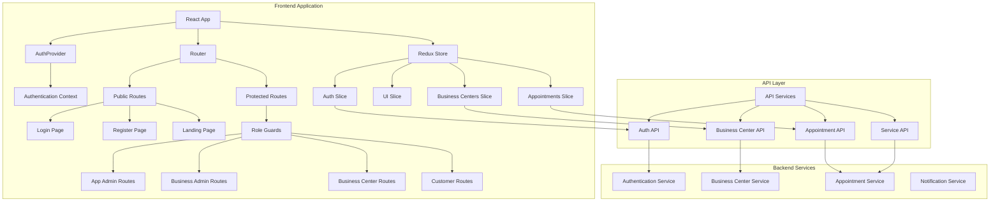

### 1.2 Component Interaction Flow

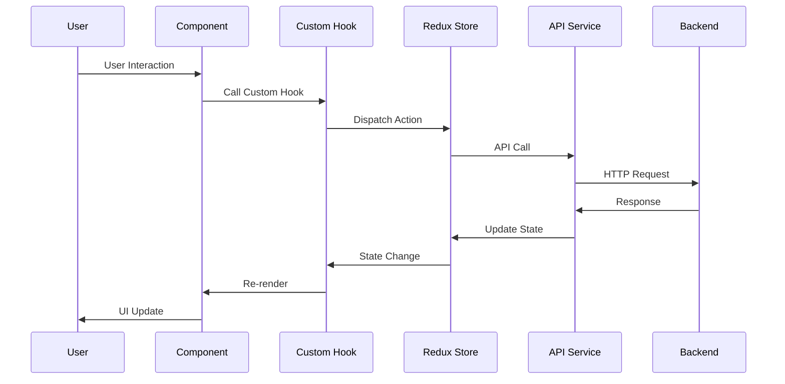

## 2. Detailed Component Architecture

### 2.1 Component Hierarchy Diagram

```mermaid
graph TD
    subgraph "Application Root"
        A[App] --> B[AuthProvider]
        A --> C[Redux Provider]
        A --> D[Router]
    end
    
    subgraph "Route Components"
        D --> E[PublicRoutes]
        D --> F[ProtectedRoutes]
        
        E --> G[LoginPage]
        E --> H[RegisterPage]
        E --> I[LandingPage]
        
        F --> J[RoleGuard: App Admin]
        F --> K[RoleGuard: Business Admin]
        F --> L[RoleGuard: Business Center]
        F --> M[RoleGuard: Customer]
    end
    
    subgraph "App Admin Components"
        J --> N[AdminDashboard]
        J --> O[UserManagement]
        J --> P[BusinessCenterApproval]
        J --> Q[SystemAnalytics]
        
        P --> R[BusinessCenterCard]
        P --> S[ApprovalActions]
        O --> T[UserTable]
        Q --> U[MetricsCard]
    end
    
    subgraph "Business Admin Components"
        K --> V[BusinessDashboard]
        K --> W[StaffManagement]
        K --> X[ServiceManagement]
        K --> Y[AppointmentOverview]
        
        W --> Z[StaffForm]
        W --> AA[StaffList]
        X --> BB[ServiceForm]
        X --> CC[ServiceTable]
    end
    
    subgraph "Customer Components"
        M --> DD[CustomerDashboard]
        M --> EE[ServiceDiscovery]
        M --> FF[AppointmentBooking]
        M --> GG[ProfileManagement]
        
        EE --> HH[ServiceCard]
        EE --> II[ServiceFilter]
        FF --> JJ[BookingForm]
        FF --> KK[CalendarView]
    end
    
    subgraph "Shared Components"
        LL[Header]
        MM[Sidebar]
        NN[Footer]
        OO[LoadingSpinner]
        PP[NotificationToast]
        QQ[ErrorBoundary]
    end
    
    N --> LL
    N --> MM
    V --> LL
    V --> MM
    DD --> LL
    DD --> MM
```

### 2.2 Component Lifecycle Flow

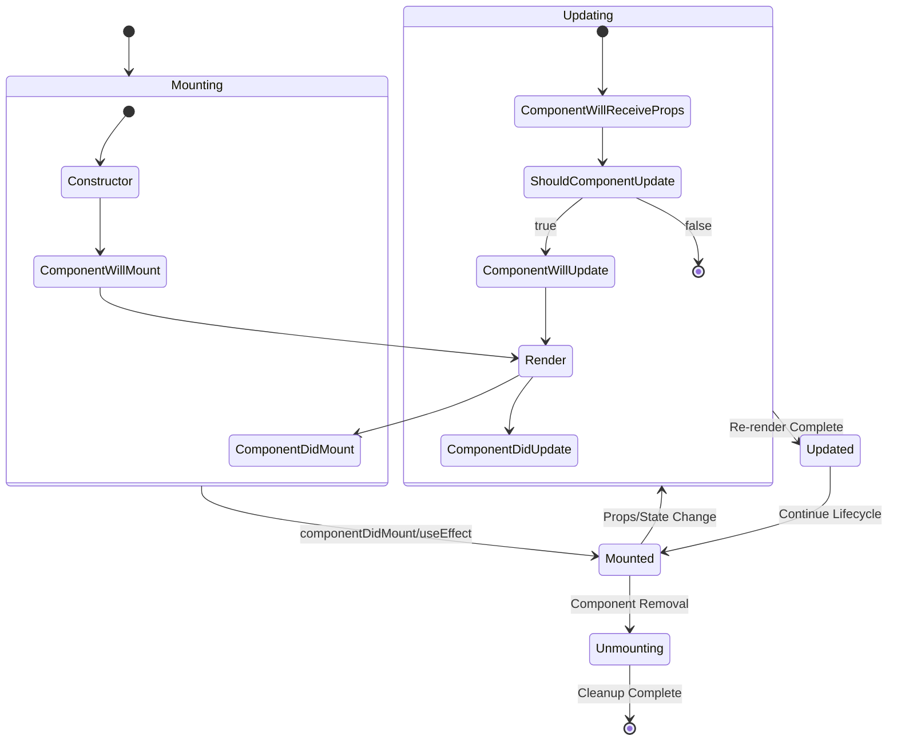

### 2.3 Component Hierarchy

```
App
├── AuthProvider
├── Router
│   ├── PublicRoutes
│   │   ├── LoginPage
│   │   ├── RegisterPage
│   │   └── LandingPage
│   └── ProtectedRoutes
│       ├── AppAdminRoutes
│       │   ├── AdminDashboard
│       │   ├── UserManagement
│       │   ├── BusinessCenterApproval
│       │   └── SystemAnalytics
│       ├── BusinessCenterAdminRoutes
│       │   ├── BusinessCenterDashboard
│       │   ├── StaffManagement
│       │   ├── ServiceManagement
│       │   └── AppointmentOverview
│       ├── BusinessCenterRoutes
│       │   ├── BusinessCenterDashboard
│       │   ├── ScheduleManagement
│       │   ├── ServiceDelivery
│       │   └── CustomerCommunication
│       └── CustomerRoutes
│           ├── CustomerDashboard
│           ├── ServiceDiscovery
│           ├── AppointmentBooking
│           └── ProfileManagement
└── GlobalComponents
    ├── Header
    ├── Sidebar
    ├── Footer
    ├── Notifications
    └── LoadingSpinner
```

### 1.2 Core Components Specifications

#### 1.2.1 Authentication Components

**LoginComponent**
```tsx
interface LoginProps {
  onLogin: (credentials: LoginCredentials) => Promise<void>;
  loading: boolean;
  error: string | null;
}

interface LoginCredentials {
  email: string;
  password: string;
  userType: 'app-admin' | 'businesscenter-admin' | 'businesscenter' | 'customer';
}
```

**RegisterComponent**
```tsx
interface RegisterProps {
  userType: UserType;
  onRegister: (data: RegistrationData) => Promise<void>;
  loading: boolean;
  error: string | null;
}

interface RegistrationData {
  email: string;
  password: string;
  confirmPassword: string;
  firstName: string;
  lastName: string;
  phone?: string;
  businessInfo?: BusinessInfo;
}
```

#### 1.2.2 Dashboard Components

**DashboardLayout**
```tsx
interface DashboardLayoutProps {
  userRole: UserRole;
  children: React.ReactNode;
  sidebarItems: SidebarItem[];
  headerActions: HeaderAction[];
}

interface SidebarItem {
  id: string;
  label: string;
  icon: React.ComponentType;
  path: string;
  permissions?: string[];
}
```

**MetricsCard**
```tsx
interface MetricsCardProps {
  title: string;
  value: string | number;
  trend?: {
    direction: 'up' | 'down' | 'neutral';
    percentage: number;
  };
  icon?: React.ComponentType;
  color?: 'primary' | 'secondary' | 'success' | 'warning' | 'error';
}
```

#### 1.2.3 Business Center Management Components

**BusinessCenterCard**
```tsx
interface BusinessCenterCardProps {
  businessCenter: BusinessCenter;
  actions: BusinessCenterAction[];
  onStatusChange?: (id: string, status: ApprovalStatus) => void;
  isLoading?: boolean;
}

interface BusinessCenter {
  id: string;
  name: string;
  description: string;
  address: Address;
  contact: ContactInfo;
  services: Service[];
  status: ApprovalStatus;
  createdAt: Date;
  attachments?: Attachment[];
}
```

**ServiceManagementTable**
```tsx
interface ServiceManagementTableProps {
  services: Service[];
  onEdit: (service: Service) => void;
  onDelete: (serviceId: string) => void;
  onStatusToggle: (serviceId: string, status: boolean) => void;
  loading: boolean;
}

interface Service {
  id: string;
  name: string;
  description: string;
  duration: number;
  price: number;
  isActive: boolean;
  businessCenterId: string;
  staffIds: string[];
  availability: AvailabilitySchedule;
}
```

#### 1.2.4 Appointment Management Components

**AppointmentCalendar**
```tsx
interface AppointmentCalendarProps {
  appointments: Appointment[];
  onDateSelect: (date: Date) => void;
  onAppointmentClick: (appointment: Appointment) => void;
  view: 'month' | 'week' | 'day';
  onViewChange: (view: CalendarView) => void;
  availableSlots?: TimeSlot[];
}

interface Appointment {
  id: string;
  customerId: string;
  businessCenterId: string;
  serviceId: string;
  staffId: string;
  startTime: Date;
  endTime: Date;
  status: AppointmentStatus;
  notes?: string;
  attachments?: Attachment[];
}
```

**AppointmentBookingForm**
```tsx
interface AppointmentBookingFormProps {
  services: Service[];
  availableSlots: TimeSlot[];
  selectedService?: Service;
  onServiceSelect: (service: Service) => void;
  onSlotSelect: (slot: TimeSlot) => void;
  onSubmit: (bookingData: BookingData) => Promise<void>;
  loading: boolean;
}

interface BookingData {
  serviceId: string;
  businessCenterId: string;
  startTime: Date;
  notes?: string;
  attachments?: File[];
}
```

## 3. State Management Architecture

### 3.1 Redux Data Flow Diagram

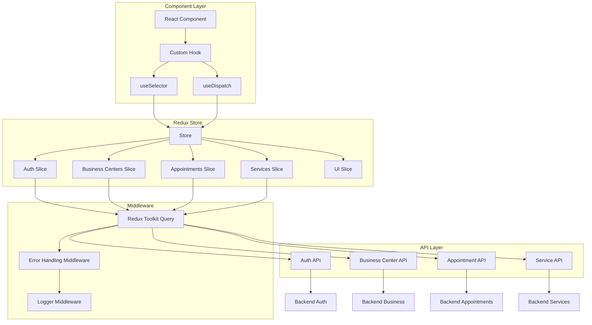

### 3.2 Authentication State Flow

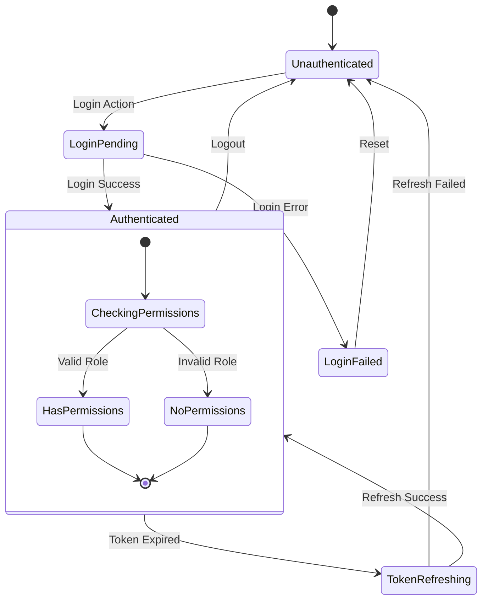

### 3.3 Business Center Management State Flow

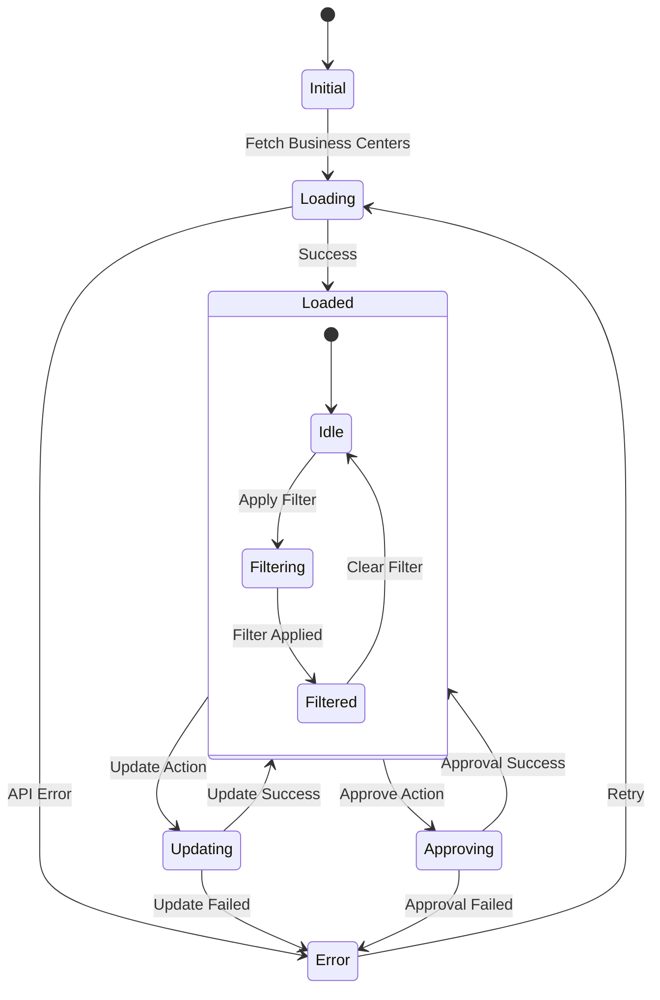

### 3.4 Redux Store Structure

```typescript
interface AppState {
  auth: AuthState;
  user: UserState;
  businessCenters: BusinessCenterState;
  appointments: AppointmentState;
  services: ServiceState;
  notifications: NotificationState;
  ui: UIState;
}

interface AuthState {
  isAuthenticated: boolean;
  user: User | null;
  token: string | null;
  refreshToken: string | null;
  loading: boolean;
  error: string | null;
}

interface BusinessCenterState {
  items: BusinessCenter[];
  currentBusinessCenter: BusinessCenter | null;
  loading: boolean;
  error: string | null;
  filters: BusinessCenterFilters;
  pagination: PaginationState;
}
```

### 2.2 Redux Slices

**authSlice.ts**
```typescript
const authSlice = createSlice({
  name: 'auth',
  initialState,
  reducers: {
    loginStart: (state) => {
      state.loading = true;
      state.error = null;
    },
    loginSuccess: (state, action) => {
      state.isAuthenticated = true;
      state.user = action.payload.user;
      state.token = action.payload.token;
      state.refreshToken = action.payload.refreshToken;
      state.loading = false;
    },
    loginFailure: (state, action) => {
      state.loading = false;
      state.error = action.payload;
    },
    logout: (state) => {
      state.isAuthenticated = false;
      state.user = null;
      state.token = null;
      state.refreshToken = null;
    },
  },
  extraReducers: (builder) => {
    // Handle async thunks
  },
});
```

### 2.3 Async Thunks

```typescript
export const loginUser = createAsyncThunk(
  'auth/login',
  async (credentials: LoginCredentials, { rejectWithValue }) => {
    try {
      const response = await authAPI.login(credentials);
      return response.data;
    } catch (error) {
      return rejectWithValue(error.response.data);
    }
  }
);

export const fetchBusinessCenters = createAsyncThunk(
  'businessCenters/fetchAll',
  async (params: BusinessCenterQueryParams) => {
    const response = await businessCenterAPI.getAll(params);
    return response.data;
  }
);
```

## 4. API Service Layer

### 4.1 API Service Architecture

```mermaid
graph TD
    subgraph "Frontend Components"
        A[React Components]
        B[Custom Hooks]
        C[Redux Actions]
    end
    
    subgraph "API Service Layer"
        D[Base API Class]
        E[Auth API]
        F[Business Center API]
        G[Appointment API]
        H[Service API]
        I[File Upload API]
    end
    
    subgraph "HTTP Client"
        J[Axios Instance]
        K[Request Interceptor]
        L[Response Interceptor]
        M[Error Handler]
    end
    
    subgraph "Backend Endpoints"
        N[/auth/*]
        O[/businesscenters/*]
        P[/appointments/*]
        Q[/services/*]
        R[/attachments/*]
    end
    
    A --> B
    B --> C
    C --> D
    
    D --> E
    D --> F
    D --> G
    D --> H
    D --> I
    
    E --> J
    F --> J
    G --> J
    H --> J
    I --> J
    
    J --> K
    K --> L
    L --> M
    
    J --> N
    J --> O
    J --> P
    J --> Q
    J --> R
```

### 4.2 API Request/Response Flow

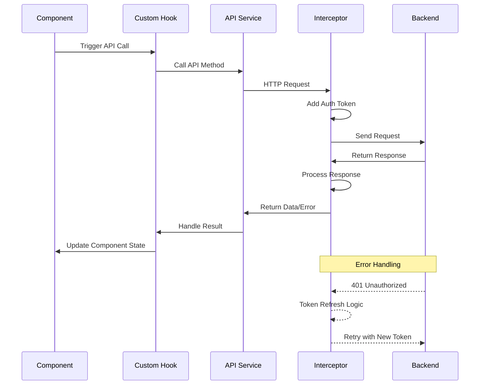

### 4.3 Error Handling Flow

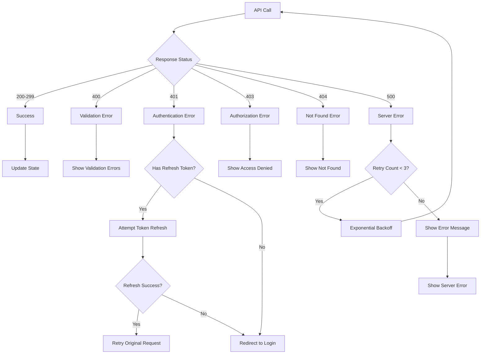

### 4.4 Base API Configuration

```typescript
import axios, { AxiosInstance, AxiosRequestConfig } from 'axios';

class BaseAPI {
  protected client: AxiosInstance;

  constructor(baseURL: string) {
    this.client = axios.create({
      baseURL,
      timeout: 10000,
      headers: {
        'Content-Type': 'application/json',
      },
    });

    this.setupInterceptors();
  }

  private setupInterceptors() {
    this.client.interceptors.request.use(
      (config) => {
        const token = localStorage.getItem('accessToken');
        if (token) {
          config.headers.Authorization = `Bearer ${token}`;
        }
        return config;
      },
      (error) => Promise.reject(error)
    );

    this.client.interceptors.response.use(
      (response) => response,
      async (error) => {
        if (error.response?.status === 401) {
          return this.handleTokenRefresh(error);
        }
        return Promise.reject(error);
      }
    );
  }
}
```

### 3.2 API Service Classes

**AuthAPI**
```typescript
class AuthAPI extends BaseAPI {
  async login(credentials: LoginCredentials) {
    return this.client.post('/auth/login', credentials);
  }

  async register(data: RegistrationData) {
    return this.client.post('/auth/register', data);
  }

  async refreshToken(refreshToken: string) {
    return this.client.post('/auth/refresh', { refreshToken });
  }

  async logout() {
    return this.client.post('/auth/logout');
  }
}
```

**BusinessCenterAPI**
```typescript
class BusinessCenterAPI extends BaseAPI {
  async getAll(params?: BusinessCenterQueryParams) {
    return this.client.get('/businesscenters', { params });
  }

  async getById(id: string) {
    return this.client.get(`/businesscenters/${id}`);
  }

  async create(data: CreateBusinessCenterData) {
    return this.client.post('/businesscenters', data);
  }

  async update(id: string, data: UpdateBusinessCenterData) {
    return this.client.put(`/businesscenters/${id}`, data);
  }

  async approve(id: string) {
    return this.client.post(`/businesscenters/${id}/approve`);
  }

  async reject(id: string) {
    return this.client.post(`/businesscenters/${id}/reject`);
  }
}
```

**AppointmentAPI**
```typescript
class AppointmentAPI extends BaseAPI {
  async getAppointments(params: AppointmentQueryParams) {
    return this.client.get('/appointments', { params });
  }

  async createAppointment(data: CreateAppointmentData) {
    return this.client.post('/appointments', data);
  }

  async updateAppointment(id: string, data: UpdateAppointmentData) {
    return this.client.put(`/appointments/${id}`, data);
  }

  async cancelAppointment(id: string) {
    return this.client.delete(`/appointments/${id}`);
  }

  async uploadAttachment(appointmentId: string, file: File) {
    const formData = new FormData();
    formData.append('file', file);
    return this.client.post(`/appointments/${appointmentId}/attachments`, formData, {
      headers: { 'Content-Type': 'multipart/form-data' },
    });
  }
}
```

## 5. Custom Hooks Architecture

### 5.1 Custom Hooks Data Flow

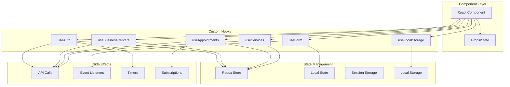

### 5.2 Authentication Hook Workflow

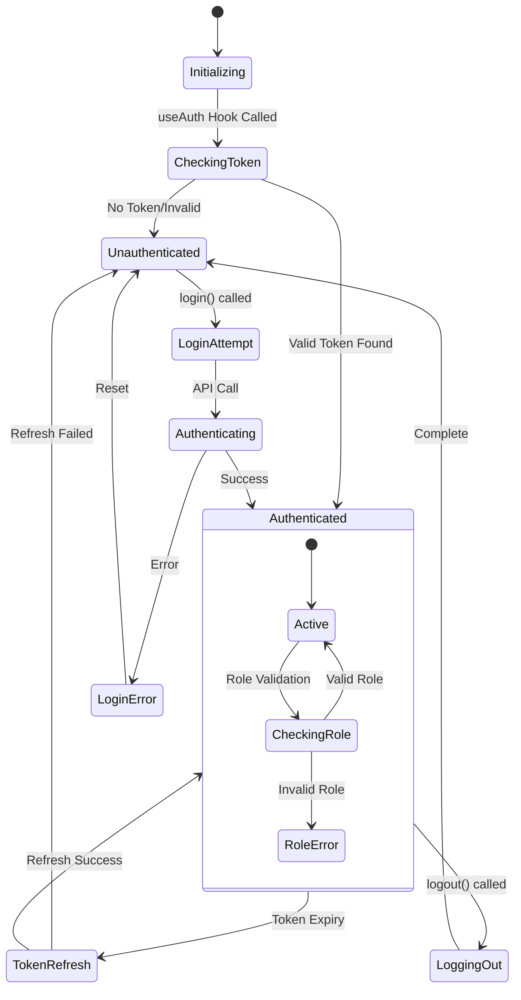

### 5.3 Business Centers Hook Flow

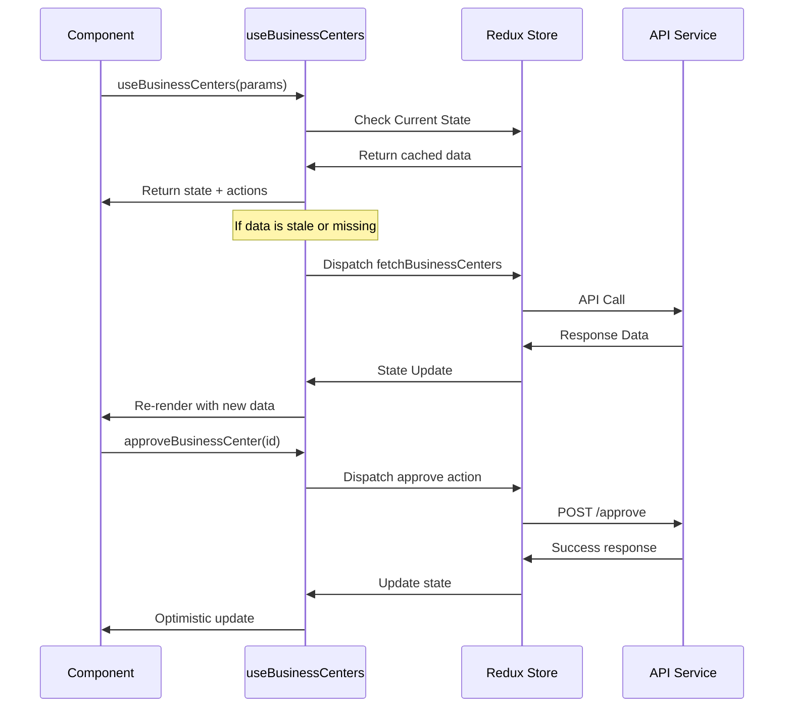

### 5.4 Authentication Hooks

```typescript
export const useAuth = () => {
  const dispatch = useAppDispatch();
  const auth = useAppSelector(state => state.auth);

  const login = useCallback(async (credentials: LoginCredentials) => {
    dispatch(loginUser(credentials));
  }, [dispatch]);

  const logout = useCallback(() => {
    dispatch(authSlice.actions.logout());
    localStorage.removeItem('accessToken');
    localStorage.removeItem('refreshToken');
  }, [dispatch]);

  return {
    ...auth,
    login,
    logout,
  };
};
```

### 4.2 Business Center Hooks

```typescript
export const useBusinessCenters = (params?: BusinessCenterQueryParams) => {
  const dispatch = useAppDispatch();
  const businessCenters = useAppSelector(state => state.businessCenters);

  useEffect(() => {
    dispatch(fetchBusinessCenters(params || {}));
  }, [dispatch, params]);

  const approveBusinessCenter = useCallback(
    (id: string) => dispatch(approveBusinessCenter(id)),
    [dispatch]
  );

  const rejectBusinessCenter = useCallback(
    (id: string) => dispatch(rejectBusinessCenter(id)),
    [dispatch]
  );

  return {
    ...businessCenters,
    approveBusinessCenter,
    rejectBusinessCenter,
  };
};
```

## 6. Routing Configuration

### 6.1 Route Structure Diagram

```mermaid
graph TD
    subgraph "Application Routes"
        A[App Router] --> B[Public Routes]
        A --> C[Protected Routes]
    end
    
    subgraph "Public Routes"
        B --> D[/ - Landing Page]
        B --> E[/login - Login Page]
        B --> F[/register - Register Page]
        B --> G[/about - About Page]
    end
    
    subgraph "Protected Route Guards"
        C --> H[Authentication Guard]
        H --> I[Role-Based Guards]
        
        I --> J[App Admin Guard]
        I --> K[Business Admin Guard]
        I --> L[Business Center Guard]
        I --> M[Customer Guard]
    end
    
    subgraph "App Admin Routes"
        J --> N[/admin/dashboard]
        J --> O[/admin/users]
        J --> P[/admin/business-centers]
        J --> Q[/admin/analytics]
        J --> R[/admin/settings]
    end
    
    subgraph "Business Admin Routes"
        K --> S[/business-admin/dashboard]
        K --> T[/business-admin/staff]
        K --> U[/business-admin/services]
        K --> V[/business-admin/appointments]
        K --> W[/business-admin/profile]
    end
    
    subgraph "Business Center Routes"
        L --> X[/business/dashboard]
        L --> Y[/business/schedule]
        L --> Z[/business/services]
        L --> AA[/business/customers]
    end
    
    subgraph "Customer Routes"
        M --> BB[/customer/dashboard]
        M --> CC[/customer/discover]
        M --> DD[/customer/appointments]
        M --> EE[/customer/profile]
        M --> FF[/customer/history]
    end
```

### 6.2 Route Navigation Flow

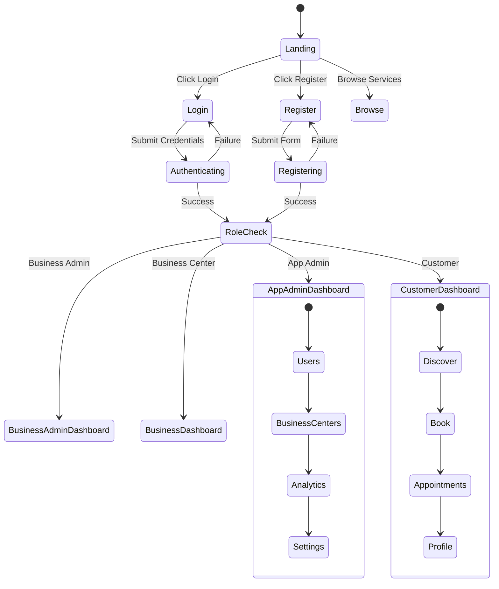

### 6.3 Route Protection Flow

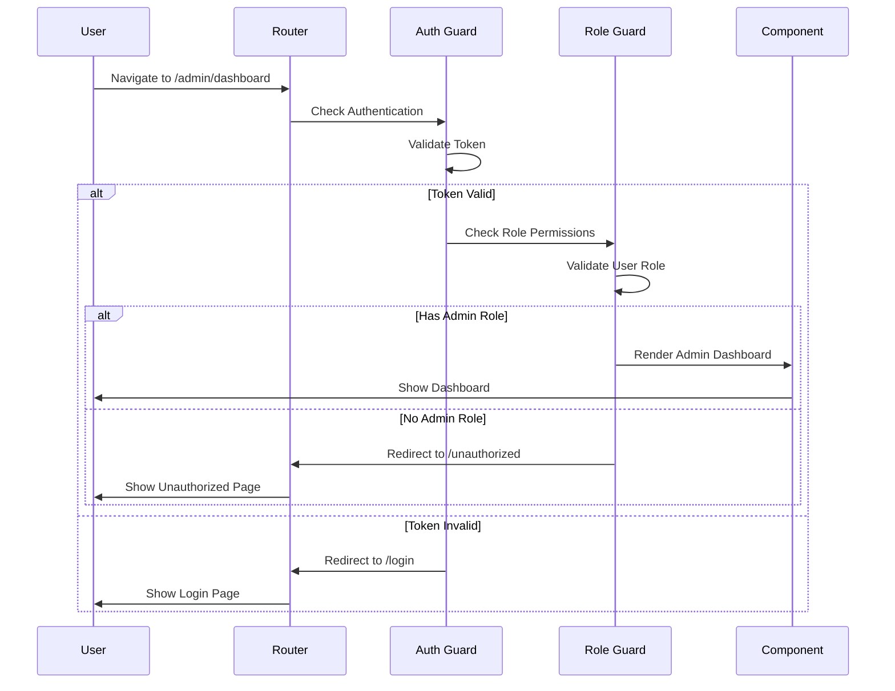

### 6.4 Route Structure

```typescript
const AppRoutes = () => {
  return (
    <Routes>
      <Route path="/login" element={<LoginPage />} />
      <Route path="/register" element={<RegisterPage />} />
      <Route path="/" element={<LandingPage />} />

      <Route element={<ProtectedRoute />}>
        <Route element={<RoleGuard allowedRoles={['app-admin']} />}>
          <Route path="/admin/*" element={<AdminRoutes />} />
        </Route>

        <Route element={<RoleGuard allowedRoles={['businesscenter-admin']} />}>
          <Route path="/business-admin/*" element={<BusinessAdminRoutes />} />
        </Route>

        <Route element={<RoleGuard allowedRoles={['businesscenter']} />}>
          <Route path="/business/*" element={<BusinessRoutes />} />
        </Route>

        <Route element={<RoleGuard allowedRoles={['customer']} />}>
          <Route path="/customer/*" element={<CustomerRoutes />} />
        </Route>
      </Route>
    </Routes>
  );
};
```

### 5.2 Route Guards

```typescript
const ProtectedRoute = () => {
  const { isAuthenticated, loading } = useAuth();

  if (loading) {
    return <LoadingSpinner />;
  }

  return isAuthenticated ? <Outlet /> : <Navigate to="/login" replace />;
};

interface RoleGuardProps {
  allowedRoles: UserRole[];
}

const RoleGuard: React.FC<RoleGuardProps> = ({ allowedRoles }) => {
  const { user } = useAuth();

  const hasPermission = user && allowedRoles.includes(user.role);

  return hasPermission ? <Outlet /> : <Navigate to="/unauthorized" replace />;
};
```

## 7. Form Handling and Validation

### 7.1 Form Validation Flow

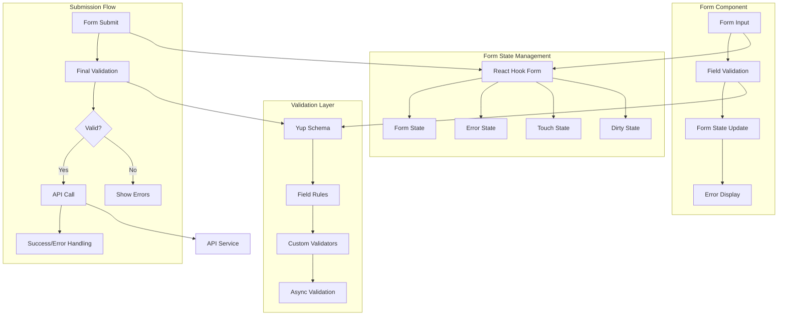

### 7.2 Real-time Validation Flow

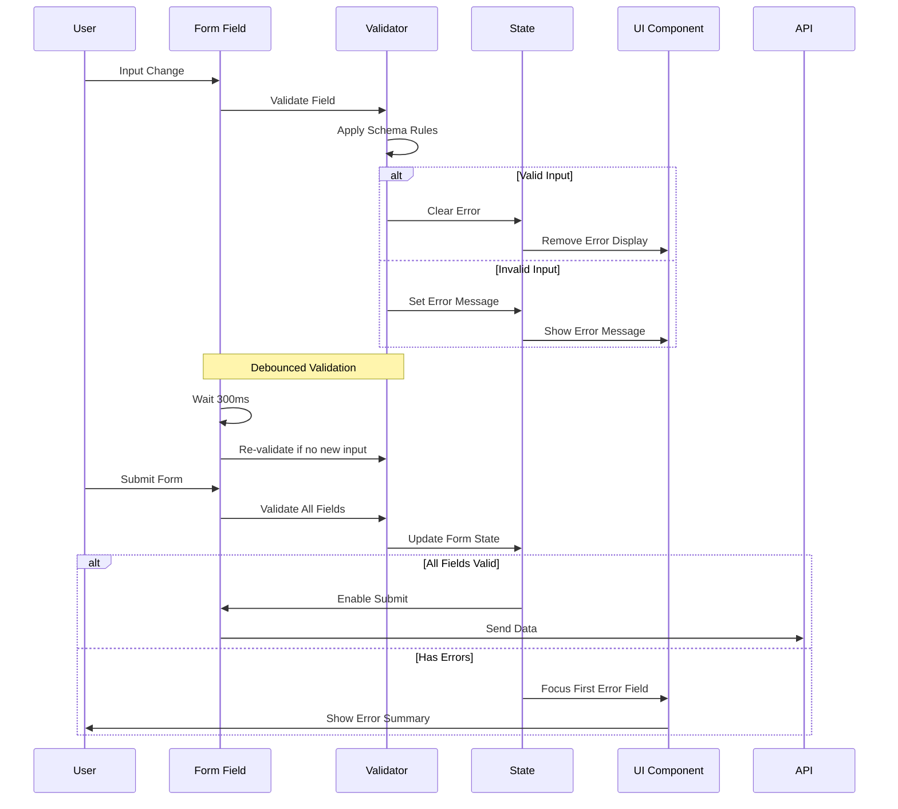

### 7.3 Multi-Step Form Flow

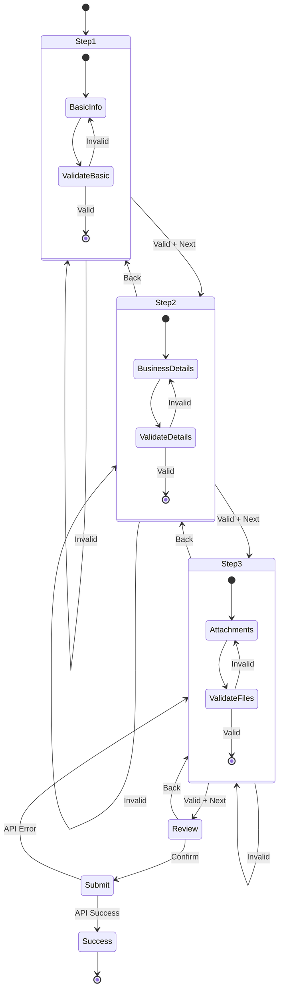

### 7.4 Validation Schemas

```typescript
import * as yup from 'yup';

export const loginSchema = yup.object({
  email: yup.string().email('Invalid email').required('Email is required'),
  password: yup.string().min(6, 'Password must be at least 6 characters').required('Password is required'),
  userType: yup.string().oneOf(['app-admin', 'businesscenter-admin', 'businesscenter', 'customer']).required(),
});

export const businessCenterSchema = yup.object({
  name: yup.string().required('Business name is required'),
  description: yup.string().required('Description is required'),
  address: yup.object({
    street: yup.string().required('Street address is required'),
    city: yup.string().required('City is required'),
    state: yup.string().required('State is required'),
    zipCode: yup.string().required('Zip code is required'),
  }),
  contact: yup.object({
    phone: yup.string().required('Phone number is required'),
    email: yup.string().email('Invalid email').required('Email is required'),
  }),
});

export const appointmentSchema = yup.object({
  serviceId: yup.string().required('Service selection is required'),
  startTime: yup.date().required('Start time is required').min(new Date(), 'Start time must be in the future'),
  notes: yup.string().max(500, 'Notes cannot exceed 500 characters'),
});
```

### 6.2 Form Components

```typescript
interface BusinessCenterFormProps {
  initialValues?: Partial<BusinessCenter>;
  onSubmit: (data: BusinessCenterFormData) => Promise<void>;
  loading?: boolean;
}

const BusinessCenterForm: React.FC<BusinessCenterFormProps> = ({
  initialValues,
  onSubmit,
  loading = false,
}) => {
  const {
    register,
    handleSubmit,
    formState: { errors, isSubmitting },
    watch,
    setValue,
  } = useForm<BusinessCenterFormData>({
    resolver: yupResolver(businessCenterSchema),
    defaultValues: initialValues,
  });

  return (
    <form onSubmit={handleSubmit(onSubmit)}>
      <Grid container spacing={3}>
        <Grid item xs={12} md={6}>
          <TextField
            {...register('name')}
            label="Business Name"
            error={!!errors.name}
            helperText={errors.name?.message}
            fullWidth
          />
        </Grid>
        
        <Grid item xs={12}>
          <TextField
            {...register('description')}
            label="Description"
            multiline
            rows={4}
            error={!!errors.description}
            helperText={errors.description?.message}
            fullWidth
          />
        </Grid>

        <Grid item xs={12} md={6}>
          <TextField
            {...register('address.street')}
            label="Street Address"
            error={!!errors.address?.street}
            helperText={errors.address?.street?.message}
            fullWidth
          />
        </Grid>

        <Grid item xs={12}>
          <Button
            type="submit"
            variant="contained"
            disabled={isSubmitting || loading}
            fullWidth
          >
            {isSubmitting ? 'Submitting...' : 'Submit'}
          </Button>
        </Grid>
      </Grid>
    </form>
  );
};
```

## 8. Error Handling

### 8.1 Error Handling Architecture

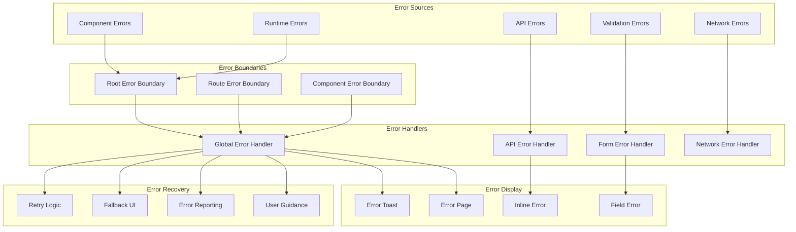

### 8.2 Error Recovery Flow

```mermaid
stateDiagram-v2
    [*] --> Normal
    Normal --> ErrorOccurred: Error Detected
    ErrorOccurred --> ErrorAnalysis: Analyze Error Type
    
    ErrorAnalysis --> NetworkError: Network Issue
    ErrorAnalysis --> ValidationError: Validation Issue
    ErrorAnalysis --> ServerError: Server Issue
    ErrorAnalysis --> ClientError: Client Issue
    
    NetworkError --> RetryAttempt: Auto Retry
    RetryAttempt --> Normal: Success
    RetryAttempt --> ShowNetworkError: Max Retries
    
    ValidationError --> ShowValidationError: Display Errors
    ShowValidationError --> Normal: User Fixes
    
    ServerError --> ShowServerError: Display Message
    ShowServerError --> RetryManual: User Retry
    RetryManual --> Normal: Success
    RetryManual --> ShowServerError: Still Failing
    
    ClientError --> ShowClientError: Display Error
    ShowClientError --> ReportError: Auto Report
    ReportError --> ShowFallback: Show Fallback UI
    ShowFallback --> Normal: User Action
    
    ShowNetworkError --> Normal: Connectivity Restored
    ShowServerError --> Normal: Server Restored
    ShowClientError --> Normal: Issue Resolved
```

### 8.3 API Error Handling Flow

```mermaid
sequenceDiagram
    participant C as Component
    participant A as API Service
    participant E as Error Handler
    participant U as UI
    participant L as Logger
    
    C->>A: API Request
    A->>A: HTTP Call
    
    alt Success Response
        A->>C: Return Data
        C->>U: Update UI
    else Client Error (4xx)
        A->>E: Handle Client Error
        E->>E: Parse Error Details
        E->>U: Show User Message
        E->>L: Log Error Context
    else Server Error (5xx)
        A->>E: Handle Server Error
        E->>E: Check Retry Policy
        
        alt Should Retry
            E->>A: Retry Request
            A->>A: Exponential Backoff
        else Max Retries Reached
            E->>U: Show Error Message
            E->>L: Log Error + Context
        end
    else Network Error
        A->>E: Handle Network Error
        E->>U: Show Offline Message
        E->>E: Queue for Retry
    end
```

### 8.4 Error Boundary

```typescript
interface ErrorBoundaryState {
  hasError: boolean;
  error?: Error;
}

class ErrorBoundary extends Component<
  React.PropsWithChildren<{}>,
  ErrorBoundaryState
> {
  constructor(props: React.PropsWithChildren<{}>) {
    super(props);
    this.state = { hasError: false };
  }

  static getDerivedStateFromError(error: Error): ErrorBoundaryState {
    return { hasError: true, error };
  }

  componentDidCatch(error: Error, errorInfo: ErrorInfo) {
    console.error('Error caught by boundary:', error, errorInfo);
    // Log to error reporting service
  }

  render() {
    if (this.state.hasError) {
      return (
        <Box
          display="flex"
          flexDirection="column"
          alignItems="center"
          justifyContent="center"
          minHeight="50vh"
        >
          <Typography variant="h5" gutterBottom>
            Something went wrong
          </Typography>
          <Button
            variant="contained"
            onClick={() => this.setState({ hasError: false })}
          >
            Try Again
          </Button>
        </Box>
      );
    }

    return this.props.children;
  }
}
```

### 7.2 Global Error Handler

```typescript
// utils/errorHandler.ts
export class AppError extends Error {
  constructor(
    message: string,
    public statusCode?: number,
    public code?: string
  ) {
    super(message);
    this.name = 'AppError';
  }
}

export const handleAPIError = (error: any): AppError => {
  if (error.response) {
    const { status, data } = error.response;
    return new AppError(
      data.message || 'An error occurred',
      status,
      data.code
    );
  } else if (error.request) {
    return new AppError('Network error occurred');
  } else {
    return new AppError('An unexpected error occurred');
  }
};
```

## 9. Performance Optimizations

### 9.1 Performance Optimization Strategy

```mermaid
graph TD
    subgraph "Loading Performance"
        A[Code Splitting] --> B[Route-based Splitting]
        A --> C[Component Splitting]
        A --> D[Vendor Splitting]
        
        E[Lazy Loading] --> F[Components]
        E --> G[Images]
        E --> H[Data]
        
        I[Bundle Optimization] --> J[Tree Shaking]
        I --> K[Minification]
        I --> L[Compression]
    end
    
    subgraph "Runtime Performance"
        M[React Optimization] --> N[Memoization]
        M --> O[Virtual Scrolling]
        M --> P[Debouncing]
        
        Q[State Management] --> R[Normalized State]
        Q --> S[Selective Updates]
        Q --> T[Caching]
        
        U[Memory Management] --> V[Cleanup Effects]
        U --> W[WeakMap Usage]
        U --> X[Event Listeners]
    end
    
    subgraph "Network Performance"
        Y[API Optimization] --> Z[Request Batching]
        Y --> AA[Response Caching]
        Y --> BB[Prefetching]
        
        CC[Asset Optimization] --> DD[CDN Usage]
        CC --> EE[Image Optimization]
        CC --> FF[Font Loading]
    end
```

### 9.2 React Performance Patterns

```mermaid
graph TD
    subgraph "Re-render Prevention"
        A[React.memo] --> B[Shallow Compare Props]
        C[useMemo] --> D[Expensive Calculations]
        E[useCallback] --> F[Function References]
        G[useState Lazy] --> H[Heavy Initial State]
    end
    
    subgraph "Component Optimization"
        I[Component Splitting] --> J[Small Components]
        K[Conditional Rendering] --> L[Early Returns]
        M[Key Props] --> N[List Optimizations]
        O[Ref Usage] --> P[DOM Manipulation]
    end
    
    subgraph "State Optimization"
        Q[State Colocation] --> R[Local State]
        S[State Normalization] --> T[Flat Structure]
        U[Derived State] --> V[Computed Values]
        W[State Splitting] --> X[Multiple useState]
    end
    
    A --> Y[Prevent Unnecessary Renders]
    C --> Y
    E --> Y
    I --> Z[Better Component Structure]
    Q --> AA[Efficient State Updates]
    S --> AA
```

### 9.3 Loading Optimization Flow

```mermaid
sequenceDiagram
    participant U as User
    participant B as Browser
    participant CDN as CDN
    participant APP as App Shell
    participant API as API
    
    U->>B: Navigate to App
    B->>CDN: Request App Shell
    CDN->>B: Return Cached Shell
    B->>U: Show Loading UI
    
    par Parallel Loading
        B->>CDN: Request Critical CSS
        B->>CDN: Request Critical JS
        B->>API: Prefetch Critical Data
    end
    
    CDN->>B: Critical Assets
    API->>B: Critical Data
    B->>APP: Initialize App
    APP->>U: Show Initial Content
    
    par Background Loading
        B->>CDN: Request Non-critical Assets
        B->>API: Prefetch Route Data
    end
    
    Note over B,API: Progressive Enhancement
    CDN->>B: Additional Assets
    API->>B: Route Data
    B->>APP: Enhanced Features
    APP->>U: Full Functionality
```

### 9.4 Caching Strategy

```mermaid
graph TD
    subgraph "Browser Caching"
        A[Service Worker] --> B[Cache API]
        C[Local Storage] --> D[User Preferences]
        E[Session Storage] --> F[Temporary Data]
        G[IndexedDB] --> H[Large Data Sets]
    end
    
    subgraph "Application Caching"
        I[React Query] --> J[Server State]
        K[Redux] --> L[Global State]
        M[Component State] --> N[Local State]
        O[Memory Cache] --> P[Computed Values]
    end
    
    subgraph "Network Caching"
        Q[HTTP Cache] --> R[Static Assets]
        S[CDN Cache] --> T[Global Distribution]
        U[API Cache] --> V[Response Data]
        W[Prefetch Cache] --> X[Predicted Requests]
    end
    
    subgraph "Cache Invalidation"
        Y[Time-based] --> Z[TTL Expiry]
        AA[Event-based] --> BB[State Changes]
        CC[Manual] --> DD[User Actions]
        EE[Version-based] --> FF[App Updates]
    end
    
    A --> Y
    I --> AA
    Q --> Y
    U --> Z
```

### 9.5 Code Splitting

```typescript
// Lazy loading of route components
const AdminRoutes = lazy(() => import('./pages/admin/AdminRoutes'));
const BusinessAdminRoutes = lazy(() => import('./pages/business-admin/BusinessAdminRoutes'));
const CustomerRoutes = lazy(() => import('./pages/customer/CustomerRoutes'));

// Component with Suspense
const AppWithSuspense = () => (
  <Suspense fallback={<LoadingSpinner />}>
    <AppRoutes />
  </Suspense>
);
```

### 8.2 Memoization

```typescript
// Memoized component
const BusinessCenterCard = React.memo<BusinessCenterCardProps>(
  ({ businessCenter, actions, onStatusChange }) => {
    const handleStatusChange = useCallback(
      (status: ApprovalStatus) => {
        onStatusChange?.(businessCenter.id, status);
      },
      [businessCenter.id, onStatusChange]
    );

    return (
      <Card>
        {/* Card content */}
      </Card>
    );
  }
);

// Memoized selector
const selectBusinessCentersByStatus = createSelector(
  [
    (state: AppState) => state.businessCenters.items,
    (state: AppState, status: ApprovalStatus) => status,
  ],
  (businessCenters, status) =>
    businessCenters.filter(bc => bc.status === status)
);
```

## 10. Testing Architecture

### 10.1 Testing Strategy Overview

```mermaid
graph TD
    subgraph "Testing Pyramid"
        A[Unit Tests] --> B[Component Tests]
        B --> C[Integration Tests]
        C --> D[E2E Tests]
        
        A --> E[70% Coverage]
        B --> F[20% Coverage]
        C --> G[8% Coverage]
        D --> H[2% Coverage]
    end
    
    subgraph "Test Types"
        I[Unit Tests] --> J[Functions/Utilities]
        I --> K[Custom Hooks]
        I --> L[API Services]
        
        M[Component Tests] --> N[Rendering]
        M --> O[User Interactions]
        M --> P[Props/State]
        
        Q[Integration Tests] --> R[API Integration]
        Q --> S[State Management]
        Q --> T[User Flows]
        
        U[E2E Tests] --> V[Critical Paths]
        U --> W[User Journeys]
        U --> X[Cross-browser]
    end
    
    subgraph "Testing Tools"
        Y[Jest] --> Z[Unit Testing]
        AA[React Testing Library] --> BB[Component Testing]
        CC[MSW] --> DD[API Mocking]
        EE[Cypress] --> FF[E2E Testing]
        GG[Storybook] --> HH[Visual Testing]
    end
```

### 10.2 Component Testing Flow

```mermaid
sequenceDiagram
    participant T as Test Suite
    participant R as Render Utils
    participant C as Component
    participant S as Mock Store
    participant API as Mock API
    
    T->>R: Render Component
    R->>S: Setup Mock State
    R->>API: Setup Mock Responses
    R->>C: Render with Providers
    
    T->>C: Simulate User Interaction
    C->>S: Dispatch Action
    S->>API: Mock API Call
    API->>S: Return Mock Data
    S->>C: Update Component
    
    T->>C: Assert UI Changes
    T->>S: Assert State Changes
    T->>API: Assert API Calls
    
    Note over T,API: Test Cleanup
    T->>R: Cleanup Render
    R->>S: Reset Store
    R->>API: Clear Mocks
```

### 10.3 Testing Workflow

```mermaid
stateDiagram-v2
    [*] --> Setup
    Setup --> WriteTest: Define Test Case
    WriteTest --> RunTest: Execute Test
    RunTest --> Pass: Test Passes
    RunTest --> Fail: Test Fails
    
    Pass --> Coverage: Check Coverage
    Fail --> Debug: Analyze Failure
    Debug --> FixCode: Fix Implementation
    Debug --> FixTest: Fix Test
    
    FixCode --> RunTest
    FixTest --> RunTest
    
    Coverage --> Sufficient: > 80%
    Coverage --> Insufficient: < 80%
    
    Insufficient --> WriteTest: Add Tests
    Sufficient --> Review: Code Review
    
    Review --> Approved: Review Passed
    Review --> Changes: Changes Requested
    
    Changes --> WriteTest
    Approved --> [*]
    
    state Setup {
        [*] --> MockSetup
        MockSetup --> TestData
        TestData --> Environment
        Environment --> [*]
    }
```

### 10.4 Mock Strategy

```mermaid
graph TD
    subgraph "API Mocking"
        A[MSW Handlers] --> B[REST Endpoints]
        A --> C[GraphQL Queries]
        A --> D[WebSocket Events]
        
        B --> E[Success Responses]
        B --> F[Error Responses]
        B --> G[Loading States]
    end
    
    subgraph "State Mocking"
        H[Mock Store] --> I[Initial State]
        H --> J[Action Dispatchers]
        H --> K[Selector Results]
        
        I --> L[Auth State]
        I --> M[Business Data]
        I --> N[UI State]
    end
    
    subgraph "Component Mocking"
        O[Mock Components] --> P[Third-party]
        O --> Q[Heavy Components]
        O --> R[External Services]
        
        P --> S[Calendar Widget]
        P --> T[Payment Gateway]
        Q --> U[Chart Components]
    end
    
    subgraph "Utility Mocking"
        V[Mock Functions] --> W[Date/Time]
        V --> X[Random Values]
        V --> Y[External APIs]
        
        W --> Z[Fixed Dates]
        X --> AA[Deterministic]
        Y --> BB[Controlled Responses]
    end
```

### 10.5 Test Utilities

```typescript
// test-utils/renderWithProviders.tsx
export const renderWithProviders = (
  ui: React.ReactElement,
  {
    preloadedState = {},
    store = setupStore(),
    ...renderOptions
  }: ExtendedRenderOptions = {}
) => {
  function Wrapper({ children }: PropsWithChildren<{}>) {
    return (
      <Provider store={store}>
        <MemoryRouter>
          <ThemeProvider theme={theme}>
            {children}
          </ThemeProvider>
        </MemoryRouter>
      </Provider>
    );
  }

  return { store, ...render(ui, { wrapper: Wrapper, ...renderOptions }) };
};
```

### 9.2 Component Tests

```typescript
// __tests__/components/BusinessCenterCard.test.tsx
describe('BusinessCenterCard', () => {
  const mockBusinessCenter: BusinessCenter = {
    id: '1',
    name: 'Test Business',
    description: 'Test Description',
    status: 'pending',
    // ... other properties
  };

  const mockActions = [
    { label: 'Approve', onClick: jest.fn() },
    { label: 'Reject', onClick: jest.fn() },
  ];

  it('renders business center information correctly', () => {
    renderWithProviders(
      <BusinessCenterCard
        businessCenter={mockBusinessCenter}
        actions={mockActions}
      />
    );

    expect(screen.getByText('Test Business')).toBeInTheDocument();
    expect(screen.getByText('Test Description')).toBeInTheDocument();
  });

  it('calls onStatusChange when approve button is clicked', async () => {
    const mockOnStatusChange = jest.fn();
    
    renderWithProviders(
      <BusinessCenterCard
        businessCenter={mockBusinessCenter}
        actions={mockActions}
        onStatusChange={mockOnStatusChange}
      />
    );

    fireEvent.click(screen.getByText('Approve'));
    
    expect(mockOnStatusChange).toHaveBeenCalledWith('1', 'approved');
  });
});
```

## 11. Build and Deployment Configuration

### 11.1 Build Pipeline Overview

```mermaid
graph TD
    subgraph "Development"
        A[Source Code] --> B[Hot Reload]
        A --> C[TypeScript Check]
        A --> D[Linting]
        A --> E[Testing]
    end
    
    subgraph "Build Process"
        F[Pre-build] --> G[Code Compilation]
        G --> H[Bundle Optimization]
        H --> I[Asset Processing]
        I --> J[Output Generation]
        
        F --> K[Environment Config]
        F --> L[Type Checking]
        
        H --> M[Code Splitting]
        H --> N[Tree Shaking]
        H --> O[Minification]
        
        I --> P[Image Optimization]
        I --> Q[CSS Processing]
        I --> R[Font Loading]
    end
    
    subgraph "Deployment"
        S[Build Artifacts] --> T[CDN Upload]
        S --> U[Static Hosting]
        S --> V[Cache Invalidation]
        
        T --> W[Global Distribution]
        U --> X[Server Configuration]
        V --> Y[Browser Cache Update]
    end
    
    A --> F
    J --> S
```

### 11.2 CI/CD Pipeline Flow

```mermaid
sequenceDiagram
    participant D as Developer
    participant R as Repository
    participant CI as CI/CD
    participant T as Testing
    participant B as Build
    participant CD as CDN
    
    D->>R: Push Code
    R->>CI: Trigger Pipeline
    
    CI->>CI: Install Dependencies
    CI->>T: Run Tests
    T->>CI: Test Results
    
    alt Tests Pass
        CI->>B: Start Build
        B->>B: Compile TypeScript
        B->>B: Bundle Assets
        B->>B: Optimize Output
        B->>CI: Build Artifacts
        
        CI->>CD: Deploy to Staging
        CD->>CI: Deployment Status
        
        Note over CI,CD: Manual Approval for Production
        CI->>CD: Deploy to Production
        CD->>CI: Production Status
        
    else Tests Fail
        CI->>D: Notify Failure
        D->>R: Fix Issues
    end
```

### 11.3 Environment Configuration Flow

```mermaid
graph TD
    subgraph "Environment Variables"
        A[.env.development] --> B[Development Config]
        C[.env.staging] --> D[Staging Config]
        E[.env.production] --> F[Production Config]
    end
    
    subgraph "Configuration Processing"
        G[Config Loader] --> H[Validate Env Vars]
        H --> I[Type Conversion]
        I --> J[Default Values]
        J --> K[Export Config]
    end
    
    subgraph "Build-time Injection"
        L[Vite Plugin] --> M[Replace Variables]
        M --> N[Bundle Assets]
        N --> O[Generate Output]
    end
    
    subgraph "Runtime Configuration"
        P[App Initialization] --> Q[Load Config]
        Q --> R[Setup Services]
        R --> S[Configure APIs]
        S --> T[Initialize App]
    end
    
    B --> G
    D --> G
    F --> G
    
    K --> L
    O --> P
```

### 11.4 Deployment Strategy

```mermaid
stateDiagram-v2
    [*] --> Development
    Development --> FeatureBranch: Create Feature
    FeatureBranch --> PullRequest: Submit PR
    PullRequest --> CodeReview: Review Process
    
    CodeReview --> Approved: Review Passed
    CodeReview --> Changes: Changes Requested
    Changes --> FeatureBranch: Update Code
    
    Approved --> Staging: Auto Deploy
    Staging --> StagingTests: Run E2E Tests
    StagingTests --> StagingApproval: Tests Pass
    StagingTests --> Development: Tests Fail
    
    StagingApproval --> Production: Manual Deploy
    Production --> Monitoring: Health Checks
    Monitoring --> Success: All Good
    Monitoring --> Rollback: Issues Detected
    
    Rollback --> Investigation: Analyze Issues
    Investigation --> Development: Fix Required
    Success --> [*]
    
    state CodeReview {
        [*] --> AutoChecks
        AutoChecks --> ManualReview
        ManualReview --> [*]
    }
    
    state Production {
        [*] --> BlueGreen
        BlueGreen --> CanaryRelease
        CanaryRelease --> FullRelease
        FullRelease --> [*]
    }
```

### 11.5 Vite Configuration

```typescript
// vite.config.ts
export default defineConfig({
  plugins: [react()],
  build: {
    rollupOptions: {
      output: {
        manualChunks: {
          vendor: ['react', 'react-dom'],
          router: ['react-router-dom'],
          ui: ['@mui/material', '@mui/icons-material'],
          state: ['@reduxjs/toolkit', 'react-redux'],
        },
      },
    },
    chunkSizeWarningLimit: 1000,
  },
  server: {
    proxy: {
      '/api': {
        target: 'http://localhost:8000',
        changeOrigin: true,
        rewrite: (path) => path.replace(/^\/api/, ''),
      },
    },
  },
});
```

### 10.2 Environment Configuration

```typescript
// config/environment.ts
interface EnvironmentConfig {
  API_BASE_URL: string;
  APP_ENV: 'development' | 'staging' | 'production';
  ENABLE_MOCKING: boolean;
  SENTRY_DSN?: string;
}

export const config: EnvironmentConfig = {
  API_BASE_URL: import.meta.env.VITE_API_BASE_URL || 'http://localhost:8000',
  APP_ENV: import.meta.env.VITE_APP_ENV || 'development',
  ENABLE_MOCKING: import.meta.env.VITE_ENABLE_MOCKING === 'true',
  SENTRY_DSN: import.meta.env.VITE_SENTRY_DSN,
};
```

This low-level design provides comprehensive technical specifications for implementing the Appo frontend application with modern React patterns, efficient state management, robust error handling, and optimal performance considerations. 