# Appo Mobile Application - Low-Level Design

## 1. Mobile Architecture Overview

### 1.1 React Native Architecture Diagram

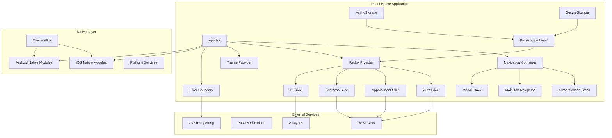

### 1.2 Component Data Flow

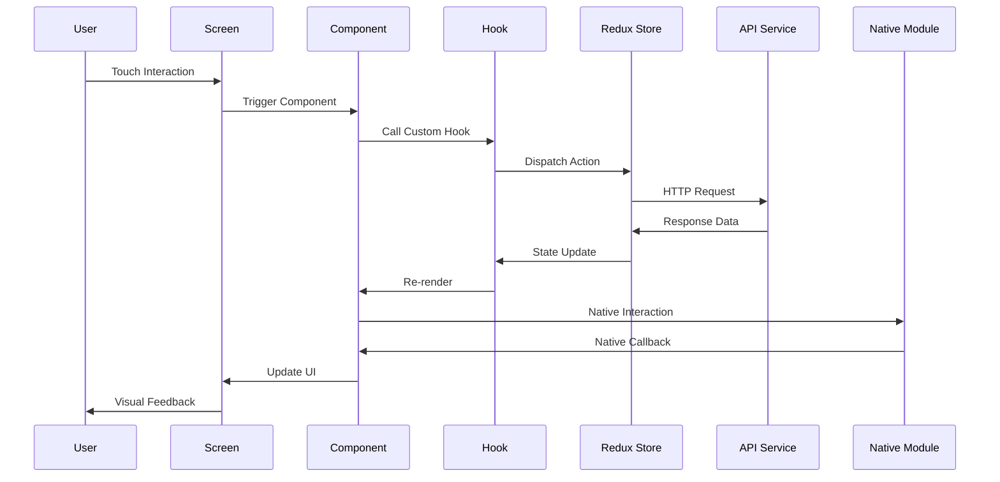

### 1.3 Navigation Architecture

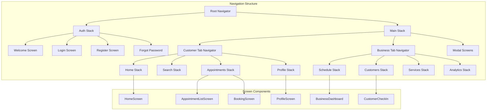

## 2. Detailed Component Architecture

### 2.1 Screen Component Structure

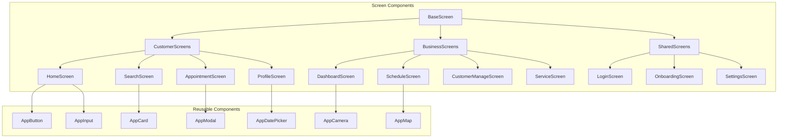

### 2.2 Component Specifications

#### 2.2.1 Authentication Components

**LoginScreen**
```tsx
interface LoginScreenProps {
  navigation: NavigationProp<AuthStackParamList, 'Login'>;
  route: RouteProp<AuthStackParamList, 'Login'>;
}

interface LoginFormData {
  email: string;
  password: string;
  userType: UserType;
  rememberMe: boolean;
}

const LoginScreen: React.FC<LoginScreenProps> = ({ navigation }) => {
  const [formData, setFormData] = useState<LoginFormData>();
  const [biometricEnabled, setBiometricEnabled] = useState(false);
  const { login, loading, error } = useAuth();
  
  const handleBiometricLogin = async () => {
    // Biometric authentication logic
  };
  
  const handleFormLogin = async (data: LoginFormData) => {
    await login(data);
  };
};
```

**BiometricAuth Component**
```tsx
interface BiometricAuthProps {
  onSuccess: (credentials: StoredCredentials) => void;
  onError: (error: string) => void;
  fallbackToPassword: () => void;
}

const BiometricAuth: React.FC<BiometricAuthProps> = ({
  onSuccess,
  onError,
  fallbackToPassword
}) => {
  const [biometricType, setBiometricType] = useState<BiometricType>();
  
  useEffect(() => {
    checkBiometricSupport();
  }, []);
  
  const authenticateWithBiometric = async () => {
    // Platform-specific biometric authentication
  };
};
```

#### 2.2.2 Booking Components

**AppointmentBooking**
```tsx
interface AppointmentBookingProps {
  businessCenterId: string;
  selectedService?: Service;
  onBookingComplete: (appointment: Appointment) => void;
}

interface BookingState {
  step: BookingStep;
  selectedService: Service | null;
  selectedDate: Date | null;
  selectedTime: TimeSlot | null;
  customerInfo: CustomerInfo;
  paymentMethod: PaymentMethod | null;
}

const AppointmentBooking: React.FC<AppointmentBookingProps> = ({
  businessCenterId,
  selectedService,
  onBookingComplete
}) => {
  const [bookingState, setBookingState] = useState<BookingState>();
  const [availableSlots, setAvailableSlots] = useState<TimeSlot[]>([]);
  
  const { createAppointment, loading } = useAppointments();
  const { location } = useLocation();
};
```

**TimeSlotPicker**
```tsx
interface TimeSlotPickerProps {
  availableSlots: TimeSlot[];
  selectedDate: Date;
  onSlotSelect: (slot: TimeSlot) => void;
  selectedSlot?: TimeSlot;
}

const TimeSlotPicker: React.FC<TimeSlotPickerProps> = ({
  availableSlots,
  selectedDate,
  onSlotSelect,
  selectedSlot
}) => {
  const [displayedSlots, setDisplayedSlots] = useState<TimeSlot[]>([]);
  
  const renderTimeSlot = ({ item }: { item: TimeSlot }) => (
    <TouchableOpacity
      style={[
        styles.timeSlot,
        selectedSlot?.id === item.id && styles.selectedSlot
      ]}
      onPress={() => onSlotSelect(item)}
    >
      <Text style={styles.timeText}>{formatTime(item.startTime)}</Text>
    </TouchableOpacity>
  );
};
```

#### 2.2.3 Location-Based Components

**NearbyBusinesses**
```tsx
interface NearbyBusinessesProps {
  userLocation: Location;
  searchRadius: number;
  serviceCategory?: string;
  onBusinessSelect: (business: BusinessCenter) => void;
}

const NearbyBusinesses: React.FC<NearbyBusinessesProps> = ({
  userLocation,
  searchRadius,
  serviceCategory,
  onBusinessSelect
}) => {
  const [businesses, setBusinesses] = useState<BusinessCenter[]>([]);
  const [mapRegion, setMapRegion] = useState<Region>();
  
  const { getBusinessesByLocation } = useBusinessCenters();
  
  useEffect(() => {
    loadNearbyBusinesses();
  }, [userLocation, searchRadius, serviceCategory]);
};
```

## 3. State Management Architecture

### 3.1 Redux Store Structure with Persistence

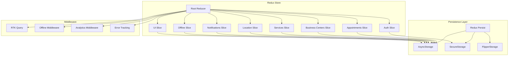

### 3.2 Mobile-Specific State Slices

**locationSlice.ts**
```typescript
interface LocationState {
  currentLocation: Location | null;
  permissionStatus: PermissionStatus;
  trackingEnabled: boolean;
  nearbyBusinesses: BusinessCenter[];
  loading: boolean;
  error: string | null;
}

const locationSlice = createSlice({
  name: 'location',
  initialState,
  reducers: {
    setCurrentLocation: (state, action) => {
      state.currentLocation = action.payload;
    },
    setPermissionStatus: (state, action) => {
      state.permissionStatus = action.payload;
    },
    toggleTracking: (state) => {
      state.trackingEnabled = !state.trackingEnabled;
    },
    setNearbyBusinesses: (state, action) => {
      state.nearbyBusinesses = action.payload;
    },
  },
  extraReducers: (builder) => {
    builder
      .addCase(getCurrentLocation.pending, (state) => {
        state.loading = true;
      })
      .addCase(getCurrentLocation.fulfilled, (state, action) => {
        state.currentLocation = action.payload;
        state.loading = false;
      });
  },
});
```

**offlineSlice.ts**
```typescript
interface OfflineState {
  isConnected: boolean;
  queuedActions: QueuedAction[];
  syncInProgress: boolean;
  lastSyncTime: Date | null;
  cachedData: CachedData;
}

const offlineSlice = createSlice({
  name: 'offline',
  initialState,
  reducers: {
    setConnectionStatus: (state, action) => {
      state.isConnected = action.payload;
    },
    queueAction: (state, action) => {
      state.queuedActions.push({
        ...action.payload,
        timestamp: new Date().toISOString(),
        id: generateId(),
      });
    },
    removeQueuedAction: (state, action) => {
      state.queuedActions = state.queuedActions.filter(
        action => action.id !== action.payload
      );
    },
    startSync: (state) => {
      state.syncInProgress = true;
    },
    completeSync: (state) => {
      state.syncInProgress = false;
      state.lastSyncTime = new Date();
      state.queuedActions = [];
    },
  },
});
```

### 3.3 Offline Data Synchronization Flow

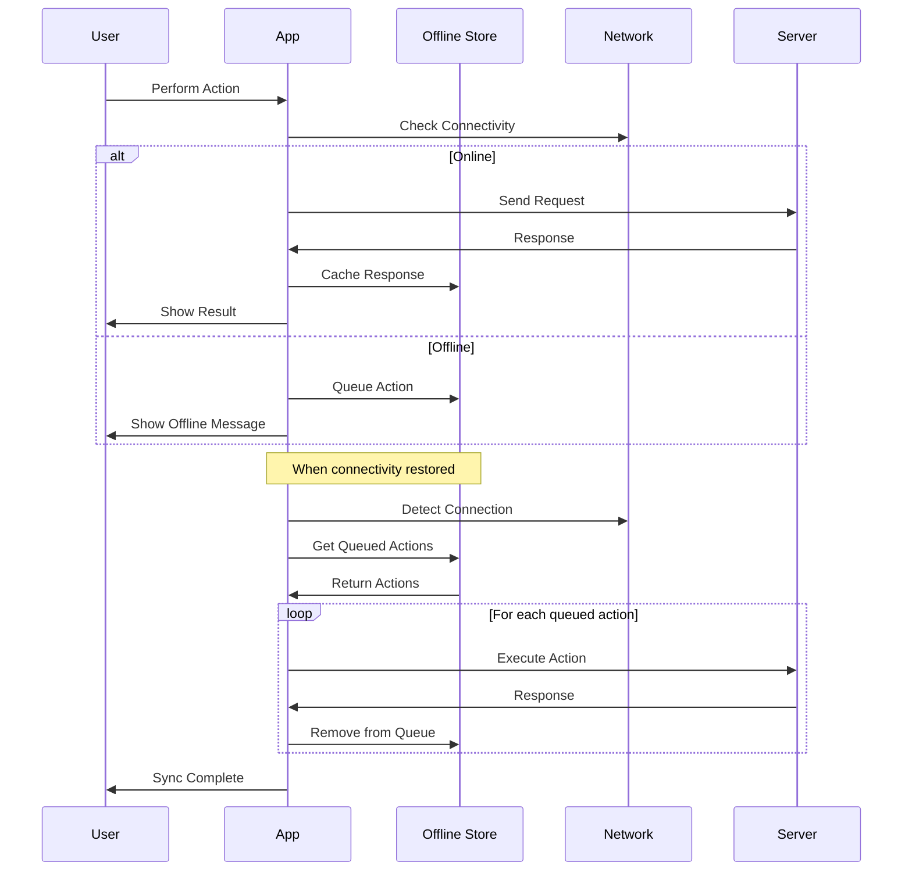

## 4. Native Module Integration

### 4.1 Device Services Architecture

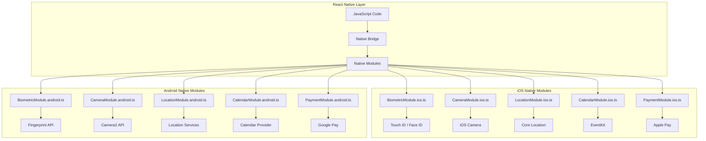

### 4.2 Native Module Implementations

**BiometricModule**
```typescript
// BiometricModule.ts
interface BiometricOptions {
  title: string;
  subtitle?: string;
  description?: string;
  fallbackLabel?: string;
  negativeLabel?: string;
}

interface BiometricResult {
  success: boolean;
  error?: string;
  biometryType?: 'TouchID' | 'FaceID' | 'Fingerprint';
}

class BiometricModule {
  static async isAvailable(): Promise<boolean> {
    return NativeBiometric.isAvailable();
  }
  
  static async getSupportedBiometryType(): Promise<string | null> {
    return NativeBiometric.getBiometryType();
  }
  
  static async authenticate(options: BiometricOptions): Promise<BiometricResult> {
    try {
      await NativeBiometric.requestBioAuth(options);
      return { success: true };
    } catch (error) {
      return { success: false, error: error.message };
    }
  }
}
```

**CameraModule**
```typescript
// CameraModule.ts
interface CameraOptions {
  mediaType: 'photo' | 'video';
  quality: 'high' | 'medium' | 'low';
  allowsEditing: boolean;
  aspect?: [number, number];
  maxWidth?: number;
  maxHeight?: number;
}

interface CameraResult {
  uri: string;
  width: number;
  height: number;
  fileSize: number;
  type: string;
  fileName: string;
}

class CameraModule {
  static async requestPermissions(): Promise<boolean> {
    const result = await request(PERMISSIONS.IOS.CAMERA);
    return result === RESULTS.GRANTED;
  }
  
  static async captureImage(options: CameraOptions): Promise<CameraResult> {
    return new Promise((resolve, reject) => {
      ImagePicker.launchCamera(options, (response) => {
        if (response.didCancel || response.errorMessage) {
          reject(new Error(response.errorMessage || 'Cancelled'));
        } else {
          resolve(response.assets[0]);
        }
      });
    });
  }
  
  static async selectFromGallery(options: CameraOptions): Promise<CameraResult> {
    return new Promise((resolve, reject) => {
      ImagePicker.launchImageLibrary(options, (response) => {
        if (response.didCancel || response.errorMessage) {
          reject(new Error(response.errorMessage || 'Cancelled'));
        } else {
          resolve(response.assets[0]);
        }
      });
    });
  }
}
```

## 5. Custom Hooks Architecture

### 5.1 Mobile-Specific Hooks

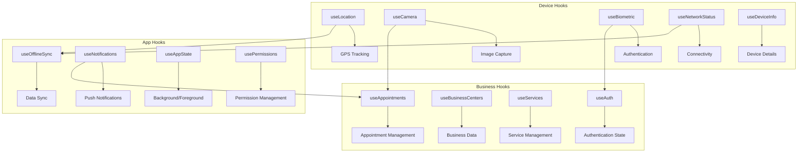

### 5.2 Hook Implementations

**useLocation Hook**
```typescript
interface LocationHook {
  location: Location | null;
  loading: boolean;
  error: string | null;
  requestPermission: () => Promise<boolean>;
  getCurrentLocation: () => Promise<Location>;
  watchPosition: (callback: (location: Location) => void) => number;
  clearWatch: (watchId: number) => void;
}

const useLocation = (): LocationHook => {
  const [location, setLocation] = useState<Location | null>(null);
  const [loading, setLoading] = useState(false);
  const [error, setError] = useState<string | null>(null);
  
  const requestPermission = useCallback(async (): Promise<boolean> => {
    try {
      const result = await request(
        Platform.OS === 'ios' 
          ? PERMISSIONS.IOS.LOCATION_WHEN_IN_USE
          : PERMISSIONS.ANDROID.ACCESS_FINE_LOCATION
      );
      return result === RESULTS.GRANTED;
    } catch (err) {
      setError('Permission request failed');
      return false;
    }
  }, []);
  
  const getCurrentLocation = useCallback(async (): Promise<Location> => {
    setLoading(true);
    setError(null);
    
    return new Promise((resolve, reject) => {
      Geolocation.getCurrentPosition(
        (position) => {
          const loc = {
            latitude: position.coords.latitude,
            longitude: position.coords.longitude,
            accuracy: position.coords.accuracy,
            timestamp: position.timestamp,
          };
          setLocation(loc);
          setLoading(false);
          resolve(loc);
        },
        (error) => {
          setError(error.message);
          setLoading(false);
          reject(error);
        },
        {
          enableHighAccuracy: true,
          timeout: 15000,
          maximumAge: 10000,
        }
      );
    });
  }, []);
  
  return {
    location,
    loading,
    error,
    requestPermission,
    getCurrentLocation,
    watchPosition: Geolocation.watchPosition,
    clearWatch: Geolocation.clearWatch,
  };
};
```

**useOfflineSync Hook**
```typescript
interface OfflineSyncHook {
  isOnline: boolean;
  queuedActions: QueuedAction[];
  syncInProgress: boolean;
  queueAction: (action: Action) => void;
  executeQueuedActions: () => Promise<void>;
  clearQueue: () => void;
}

const useOfflineSync = (): OfflineSyncHook => {
  const dispatch = useAppDispatch();
  const { isConnected, queuedActions, syncInProgress } = useAppSelector(
    state => state.offline
  );
  
  const [isOnline, setIsOnline] = useState(isConnected);
  
  useEffect(() => {
    const unsubscribe = NetInfo.addEventListener(state => {
      const online = state.isConnected && state.isInternetReachable;
      setIsOnline(online);
      dispatch(setConnectionStatus(online));
      
      if (online && queuedActions.length > 0) {
        executeQueuedActions();
      }
    });
    
    return unsubscribe;
  }, []);
  
  const queueAction = useCallback((action: Action) => {
    if (!isOnline) {
      dispatch(queueAction(action));
    }
  }, [isOnline, dispatch]);
  
  const executeQueuedActions = useCallback(async () => {
    if (syncInProgress || queuedActions.length === 0) return;
    
    dispatch(startSync());
    
    try {
      for (const queuedAction of queuedActions) {
        await dispatch(queuedAction.action);
        dispatch(removeQueuedAction(queuedAction.id));
      }
      dispatch(completeSync());
    } catch (error) {
      console.error('Sync failed:', error);
      dispatch(completeSync());
    }
  }, [queuedActions, syncInProgress, dispatch]);
  
  return {
    isOnline,
    queuedActions,
    syncInProgress,
    queueAction,
    executeQueuedActions,
    clearQueue: () => dispatch(clearQueue()),
  };
};
```

## 6. Navigation Implementation

### 6.1 Navigation Structure

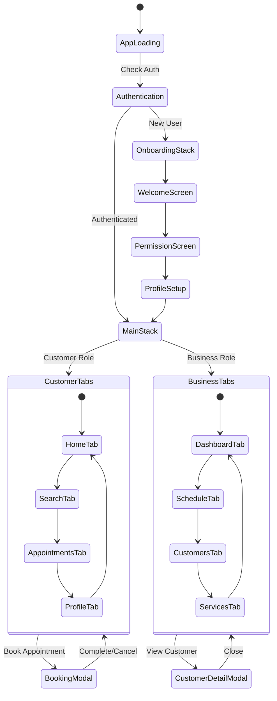

### 6.2 Navigation Configuration

**RootNavigator.tsx**
```tsx
type RootStackParamList = {
  Auth: undefined;
  Main: undefined;
  Onboarding: undefined;
  Modal: { screen: string; params?: any };
};

const RootStack = createStackNavigator<RootStackParamList>();

const RootNavigator: React.FC = () => {
  const { isAuthenticated, isFirstTime } = useAuth();
  const [isLoading, setIsLoading] = useState(true);
  
  useEffect(() => {
    checkAuthState();
  }, []);
  
  const checkAuthState = async () => {
    try {
      // Check stored auth token
      // Verify token with server
      // Set authentication state
    } finally {
      setIsLoading(false);
    }
  };
  
  if (isLoading) {
    return <SplashScreen />;
  }
  
  return (
    <NavigationContainer>
      <RootStack.Navigator screenOptions={{ headerShown: false }}>
        {!isAuthenticated ? (
          <RootStack.Screen name="Auth" component={AuthNavigator} />
        ) : isFirstTime ? (
          <RootStack.Screen name="Onboarding" component={OnboardingNavigator} />
        ) : (
          <RootStack.Screen name="Main" component={MainNavigator} />
        )}
        <RootStack.Group screenOptions={{ presentation: 'modal' }}>
          <RootStack.Screen name="Modal" component={ModalNavigator} />
        </RootStack.Group>
      </RootStack.Navigator>
    </NavigationContainer>
  );
};
```

**CustomerTabNavigator.tsx**
```tsx
type CustomerTabParamList = {
  Home: undefined;
  Search: { category?: string };
  Appointments: undefined;
  Profile: undefined;
};

const CustomerTab = createBottomTabNavigator<CustomerTabParamList>();

const CustomerTabNavigator: React.FC = () => {
  const theme = useTheme();
  const { hasNotifications } = useNotifications();
  
  return (
    <CustomerTab.Navigator
      screenOptions={({ route }) => ({
        tabBarIcon: ({ focused, color, size }) => {
          const iconName = getTabIcon(route.name, focused);
          return <Icon name={iconName} size={size} color={color} />;
        },
        tabBarActiveTintColor: theme.colors.primary,
        tabBarInactiveTintColor: theme.colors.text.secondary,
        tabBarStyle: {
          backgroundColor: theme.colors.surface,
          borderTopColor: theme.colors.border,
        },
        headerShown: false,
      })}
    >
      <CustomerTab.Screen 
        name="Home" 
        component={HomeStackNavigator}
        options={{ tabBarLabel: 'Home' }}
      />
      <CustomerTab.Screen 
        name="Search" 
        component={SearchStackNavigator}
        options={{ tabBarLabel: 'Search' }}
      />
      <CustomerTab.Screen 
        name="Appointments" 
        component={AppointmentsStackNavigator}
        options={{ 
          tabBarLabel: 'Appointments',
          tabBarBadge: hasNotifications ? '!' : undefined,
        }}
      />
      <CustomerTab.Screen 
        name="Profile" 
        component={ProfileStackNavigator}
        options={{ tabBarLabel: 'Profile' }}
      />
    </CustomerTab.Navigator>
  );
};
```

## 7. Performance Optimization

### 7.1 React Native Performance Strategy

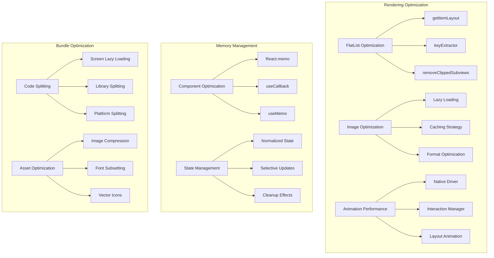

### 7.2 List Performance Implementation

**OptimizedAppointmentList**
```tsx
interface AppointmentListProps {
  appointments: Appointment[];
  onAppointmentPress: (appointment: Appointment) => void;
  onRefresh: () => void;
  loading: boolean;
}

const AppointmentList: React.FC<AppointmentListProps> = React.memo(({
  appointments,
  onAppointmentPress,
  onRefresh,
  loading
}) => {
  const [refreshing, setRefreshing] = useState(false);
  
  const keyExtractor = useCallback(
    (item: Appointment) => item.id,
    []
  );
  
  const getItemLayout = useCallback(
    (data: any, index: number) => ({
      length: APPOINTMENT_ITEM_HEIGHT,
      offset: APPOINTMENT_ITEM_HEIGHT * index,
      index,
    }),
    []
  );
  
  const renderAppointment = useCallback(
    ({ item }: { item: Appointment }) => (
      <AppointmentItem
        appointment={item}
        onPress={onAppointmentPress}
      />
    ),
    [onAppointmentPress]
  );
  
  const onRefreshList = useCallback(async () => {
    setRefreshing(true);
    await onRefresh();
    setRefreshing(false);
  }, [onRefresh]);
  
  return (
    <FlatList
      data={appointments}
      renderItem={renderAppointment}
      keyExtractor={keyExtractor}
      getItemLayout={getItemLayout}
      removeClippedSubviews={true}
      maxToRenderPerBatch={10}
      updateCellsBatchingPeriod={50}
      initialNumToRender={10}
      windowSize={10}
      refreshControl={
        <RefreshControl
          refreshing={refreshing}
          onRefresh={onRefreshList}
          tintColor={colors.primary}
        />
      }
      showsVerticalScrollIndicator={false}
    />
  );
});
```

### 7.3 Image Optimization

**OptimizedImage Component**
```tsx
interface OptimizedImageProps {
  source: ImageSource;
  style?: StyleProp<ImageStyle>;
  placeholder?: string;
  resizeMode?: ImageResizeMode;
  onLoad?: () => void;
  onError?: (error: any) => void;
}

const OptimizedImage: React.FC<OptimizedImageProps> = ({
  source,
  style,
  placeholder,
  resizeMode = 'cover',
  onLoad,
  onError
}) => {
  const [loading, setLoading] = useState(true);
  const [error, setError] = useState(false);
  
  const handleLoad = useCallback(() => {
    setLoading(false);
    onLoad?.();
  }, [onLoad]);
  
  const handleError = useCallback((err: any) => {
    setLoading(false);
    setError(true);
    onError?.(err);
  }, [onError]);
  
  if (error && placeholder) {
    return (
      <Image
        source={{ uri: placeholder }}
        style={style}
        resizeMode={resizeMode}
      />
    );
  }
  
  return (
    <View style={style}>
      {loading && placeholder && (
        <Image
          source={{ uri: placeholder }}
          style={[StyleSheet.absoluteFillObject, { opacity: 0.3 }]}
          resizeMode={resizeMode}
        />
      )}
      <FastImage
        source={source}
        style={StyleSheet.absoluteFillObject}
        resizeMode={FastImage.resizeMode[resizeMode]}
        onLoad={handleLoad}
        onError={handleError}
      />
      {loading && (
        <ActivityIndicator
          size="small"
          color={colors.primary}
          style={StyleSheet.absoluteFillObject}
        />
      )}
    </View>
  );
};
```

## 8. Testing Architecture

### 8.1 Mobile Testing Strategy

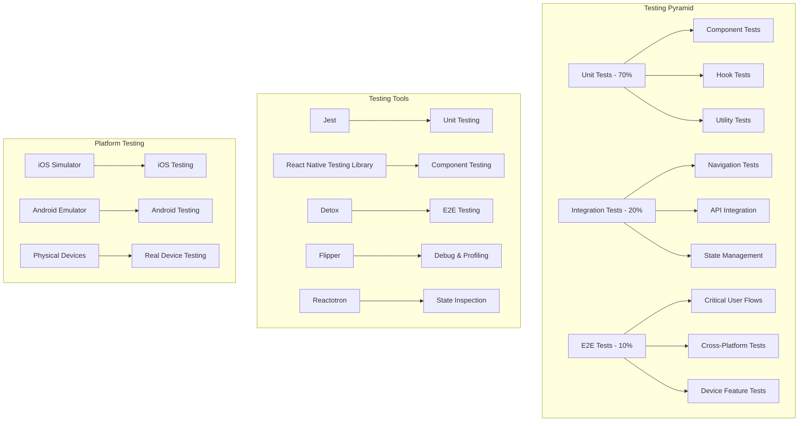

### 8.2 Component Testing Implementation

**AppointmentCard.test.tsx**
```tsx
import React from 'react';
import { render, fireEvent, waitFor } from '@testing-library/react-native';
import { AppointmentCard } from '../AppointmentCard';
import { mockAppointment } from '../../__mocks__/appointments';

const TestWrapper: React.FC<{ children: React.ReactNode }> = ({ children }) => (
  <Provider store={mockStore}>
    <ThemeProvider theme={lightTheme}>
      {children}
    </ThemeProvider>
  </Provider>
);

describe('AppointmentCard', () => {
  const mockOnPress = jest.fn();
  const mockOnCancel = jest.fn();
  
  beforeEach(() => {
    jest.clearAllMocks();
  });
  
  it('renders appointment information correctly', () => {
    const { getByText, getByTestId } = render(
      <TestWrapper>
        <AppointmentCard
          appointment={mockAppointment}
          onPress={mockOnPress}
          onCancel={mockOnCancel}
        />
      </TestWrapper>
    );
    
    expect(getByText(mockAppointment.serviceName)).toBeTruthy();
    expect(getByText(mockAppointment.businessName)).toBeTruthy();
    expect(getByTestId('appointment-date')).toBeTruthy();
  });
  
  it('calls onPress when card is tapped', () => {
    const { getByTestId } = render(
      <TestWrapper>
        <AppointmentCard
          appointment={mockAppointment}
          onPress={mockOnPress}
          onCancel={mockOnCancel}
        />
      </TestWrapper>
    );
    
    fireEvent.press(getByTestId('appointment-card'));
    expect(mockOnPress).toHaveBeenCalledWith(mockAppointment);
  });
  
  it('shows cancel option for upcoming appointments', async () => {
    const upcomingAppointment = {
      ...mockAppointment,
      status: 'confirmed',
      startTime: new Date(Date.now() + 24 * 60 * 60 * 1000), // Tomorrow
    };
    
    const { getByTestId } = render(
      <TestWrapper>
        <AppointmentCard
          appointment={upcomingAppointment}
          onPress={mockOnPress}
          onCancel={mockOnCancel}
        />
      </TestWrapper>
    );
    
    const cancelButton = getByTestId('cancel-appointment');
    expect(cancelButton).toBeTruthy();
    
    fireEvent.press(cancelButton);
    
    await waitFor(() => {
      expect(mockOnCancel).toHaveBeenCalledWith(upcomingAppointment.id);
    });
  });
});
```

### 8.3 E2E Testing with Detox

**appointmentBooking.e2e.js**
```javascript
describe('Appointment Booking Flow', () => {
  beforeAll(async () => {
    await device.launchApp();
  });
  
  beforeEach(async () => {
    await device.reloadReactNative();
  });
  
  it('should complete appointment booking flow', async () => {
    // Navigate to search
    await element(by.id('search-tab')).tap();
    
    // Search for business
    await element(by.id('search-input')).typeText('Hair Salon');
    await element(by.id('search-button')).tap();
    
    // Select business
    await waitFor(element(by.id('business-card-0')))
      .toBeVisible()
      .withTimeout(5000);
    await element(by.id('business-card-0')).tap();
    
    // Select service
    await element(by.id('service-item-0')).tap();
    await element(by.id('book-service-button')).tap();
    
    // Select date and time
    await element(by.id('date-picker')).tap();
    await element(by.text('Tomorrow')).tap();
    await element(by.id('time-slot-0')).tap();
    
    // Confirm booking
    await element(by.id('confirm-booking')).tap();
    
    // Verify booking success
    await waitFor(element(by.text('Booking Confirmed')))
      .toBeVisible()
      .withTimeout(3000);
    
    await element(by.text('OK')).tap();
    
    // Verify appointment appears in appointments tab
    await element(by.id('appointments-tab')).tap();
    await expect(element(by.id('appointment-item-0'))).toBeVisible();
  });
  
  it('should handle offline booking', async () => {
    // Simulate offline mode
    await device.setURLBlacklist(['*']);
    
    // Attempt to book appointment
    await element(by.id('search-tab')).tap();
    await element(by.id('search-input')).typeText('Hair Salon');
    await element(by.id('search-button')).tap();
    
    // Should show offline message
    await expect(element(by.text('You are offline'))).toBeVisible();
    
    // Re-enable network
    await device.setURLBlacklist([]);
    
    // Should automatically retry
    await waitFor(element(by.id('business-card-0')))
      .toBeVisible()
      .withTimeout(5000);
  });
});
```

## 9. Build and Deployment

### 9.1 Build Configuration

**metro.config.js**
```javascript
const { getDefaultConfig } = require('metro-config');

module.exports = (async () => {
  const {
    resolver: { sourceExts, assetExts },
  } = await getDefaultConfig();
  
  return {
    transformer: {
      getTransformOptions: async () => ({
        transform: {
          experimentalImportSupport: false,
          inlineRequires: true,
        },
      }),
    },
    resolver: {
      assetExts: assetExts.filter(ext => ext !== 'svg'),
      sourceExts: [...sourceExts, 'svg'],
    },
    serializer: {
      getModulesRunBeforeMainModule: () => [
        require.resolve('react-native/Libraries/Core/InitializeCore'),
      ],
    },
  };
})();
```

**react-native.config.js**
```javascript
module.exports = {
  dependencies: {
    'react-native-vector-icons': {
      platforms: {
        ios: {
          sourceDir: '../node_modules/react-native-vector-icons/Fonts',
          fonts: ['*.ttf'],
        },
        android: {
          sourceDir: '../node_modules/react-native-vector-icons/Fonts',
          fonts: ['*.ttf'],
        },
      },
    },
  },
  assets: ['./src/assets/fonts/'],
};
```

This comprehensive low-level design provides detailed technical specifications for implementing the React Native mobile application with modern patterns, optimal performance, and robust architecture. 