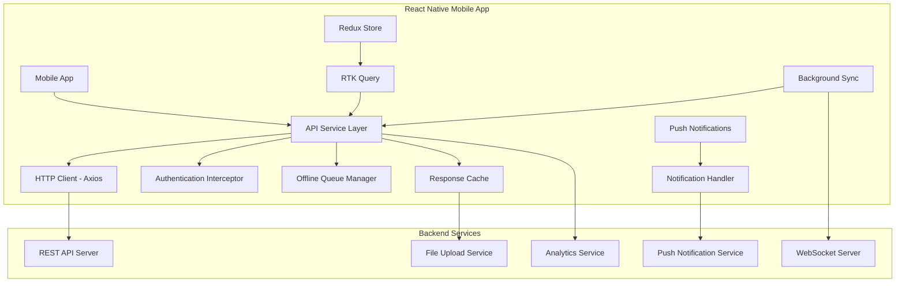
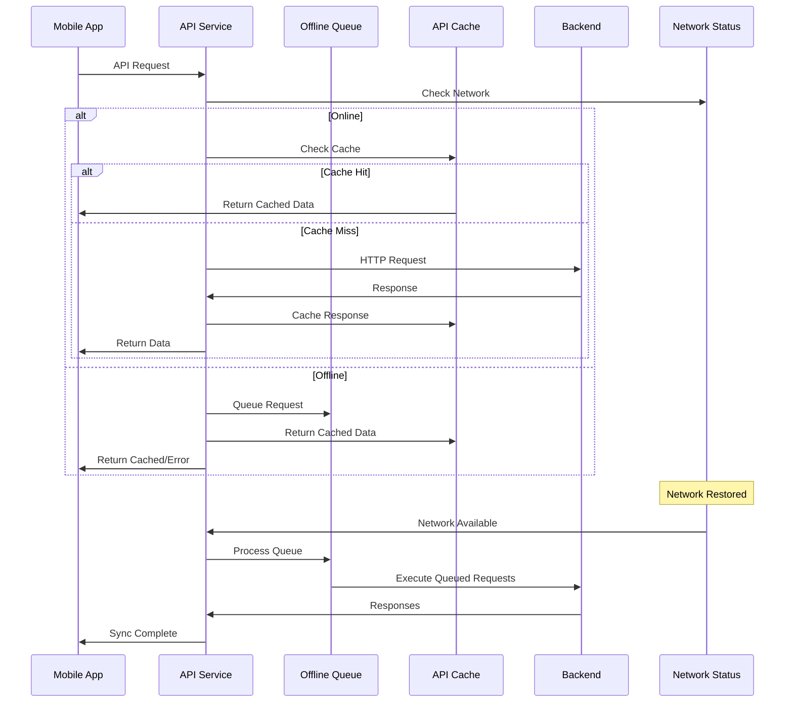
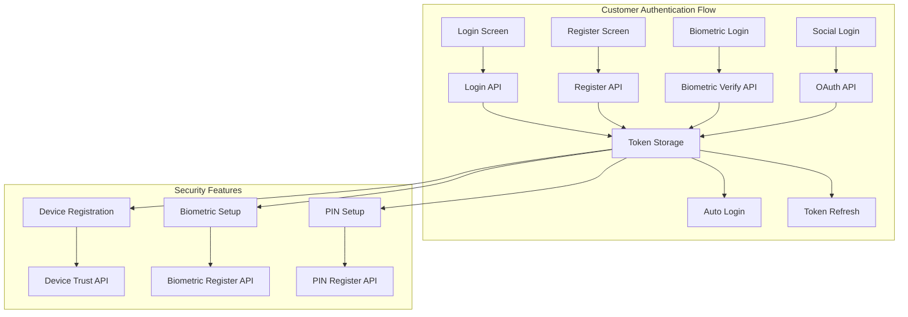
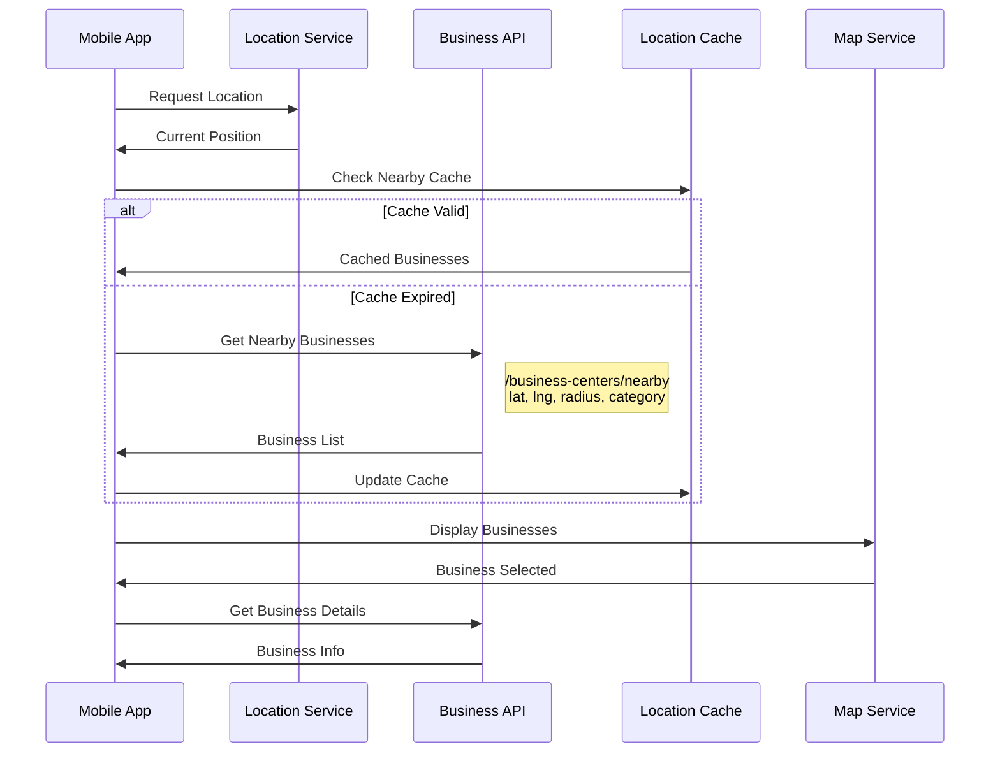
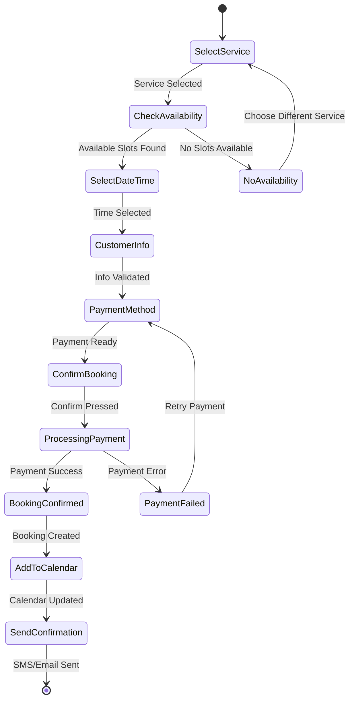
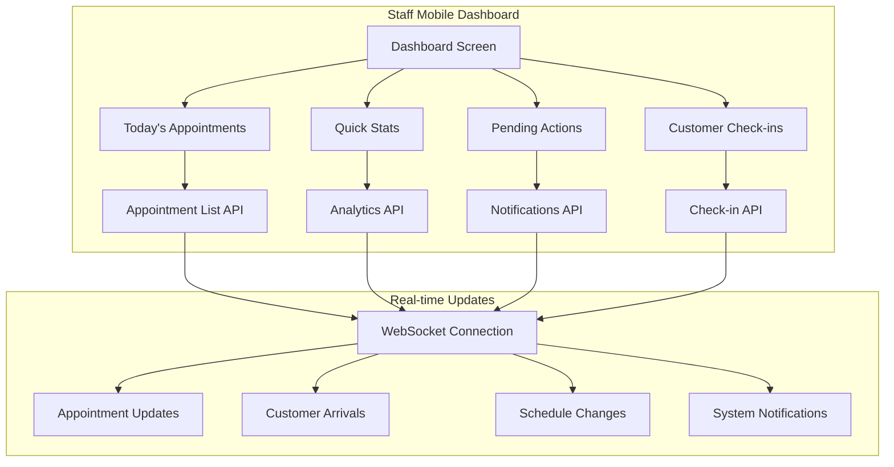
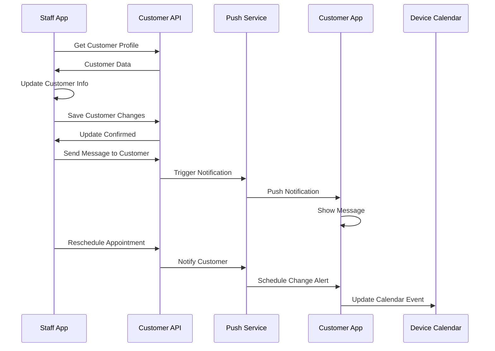
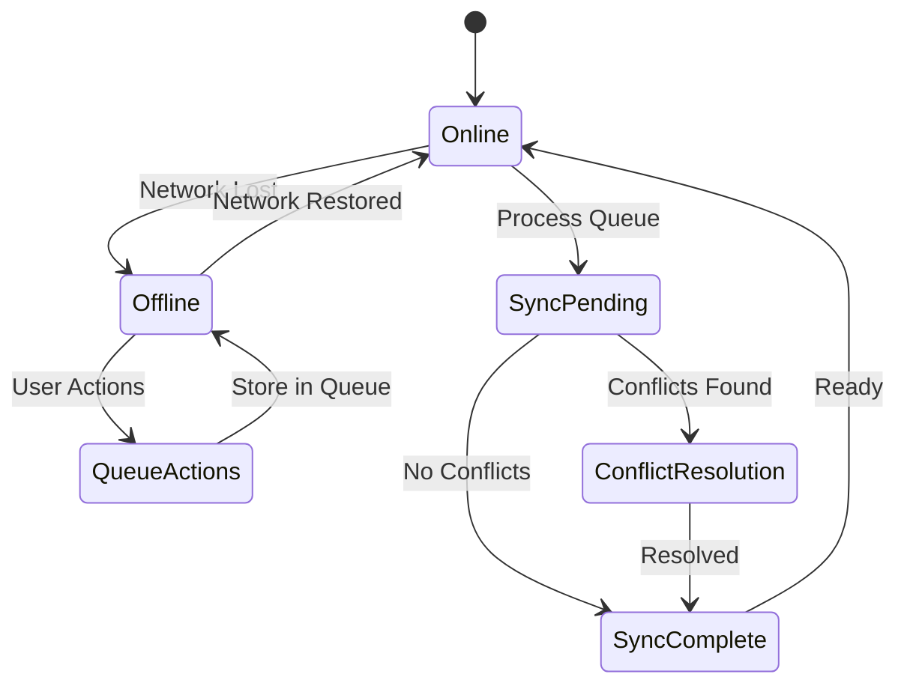
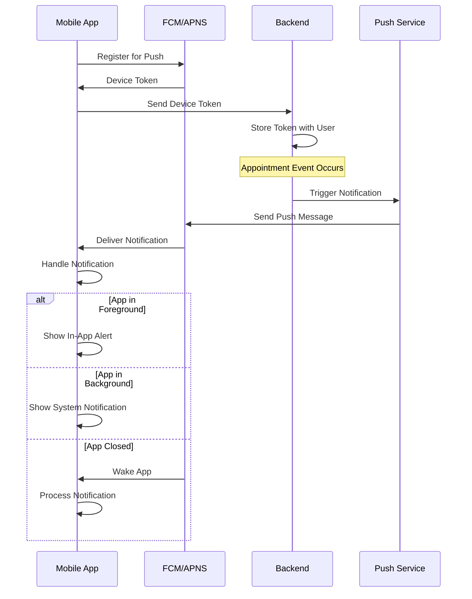
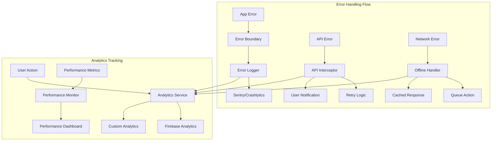

# Appo Mobile Application - API Integration Mapping

## 1. Mobile-Specific API Integration Overview

### 1.1 Mobile API Architecture



### 1.2 Mobile API Service Implementation



## 2. Customer Mobile App API Integration

### 2.1 Authentication API Integration



#### 2.1.1 Mobile Authentication Service

**AuthService.ts**
```typescript
interface MobileAuthService {
  // Standard authentication
  login(credentials: LoginCredentials): Promise<AuthResponse>;
  register(userData: RegisterData): Promise<AuthResponse>;
  logout(): Promise<void>;
  
  // Mobile-specific authentication
  biometricLogin(biometricData: BiometricData): Promise<AuthResponse>;
  deviceLogin(deviceToken: string): Promise<AuthResponse>;
  socialLogin(provider: SocialProvider, token: string): Promise<AuthResponse>;
  
  // Token management
  refreshToken(): Promise<string>;
  validateToken(token: string): Promise<boolean>;
  
  // Device security
  registerDevice(deviceInfo: DeviceInfo): Promise<void>;
  unregisterDevice(deviceId: string): Promise<void>;
}

class MobileAuthService implements MobileAuthService {
  private apiClient: AxiosInstance;
  private secureStorage: SecureStorageService;
  private biometricService: BiometricService;
  
  constructor() {
    this.apiClient = createAuthenticatedClient();
    this.secureStorage = new SecureStorageService();
    this.biometricService = new BiometricService();
  }
  
  async biometricLogin(biometricData: BiometricData): Promise<AuthResponse> {
    try {
      // Verify biometric data locally first
      const isValid = await this.biometricService.verify(biometricData);
      if (!isValid) {
        throw new Error('Biometric verification failed');
      }
      
      // Get stored credentials
      const storedCredentials = await this.secureStorage.getCredentials();
      
      // Authenticate with server
      const response = await this.apiClient.post('/auth/biometric-login', {
        deviceId: await DeviceInfo.getUniqueId(),
        biometricHash: biometricData.hash,
        credentialId: storedCredentials.id,
      });
      
      await this.handleAuthSuccess(response.data);
      return response.data;
    } catch (error) {
      throw new AuthError('Biometric login failed', error);
    }
  }
  
  async deviceLogin(deviceToken: string): Promise<AuthResponse> {
    const response = await this.apiClient.post('/auth/device-login', {
      deviceToken,
      deviceInfo: await this.getDeviceInfo(),
    });
    
    await this.handleAuthSuccess(response.data);
    return response.data;
  }
}
```

### 2.2 Location-Based Service Discovery



#### 2.2.1 Location-Based Business Discovery

**LocationBusinessService.ts**
```typescript
interface LocationBusinessService {
  getNearbyBusinesses(params: NearbySearchParams): Promise<BusinessCenter[]>;
  getBusinessRoute(businessId: string, userLocation: Location): Promise<RouteInfo>;
  trackUserLocation(callback: (location: Location) => void): number;
  stopLocationTracking(watchId: number): void;
}

interface NearbySearchParams {
  latitude: number;
  longitude: number;
  radius: number; // in meters
  category?: string;
  services?: string[];
  availability?: 'now' | 'today' | 'week';
  sortBy?: 'distance' | 'rating' | 'price';
}

class LocationBusinessService {
  private apiClient: AxiosInstance;
  private locationCache: LocationCache;
  
  async getNearbyBusinesses(params: NearbySearchParams): Promise<BusinessCenter[]> {
    const cacheKey = this.generateCacheKey(params);
    
    // Check cache first (valid for 5 minutes)
    const cached = await this.locationCache.get(cacheKey);
    if (cached && !this.isCacheExpired(cached, 5 * 60 * 1000)) {
      return cached.data;
    }
    
    try {
      const response = await this.apiClient.get('/business-centers/nearby', {
        params: {
          lat: params.latitude,
          lng: params.longitude,
          radius: params.radius,
          category: params.category,
          services: params.services?.join(','),
          availability: params.availability,
          sort: params.sortBy,
        },
      });
      
      // Calculate distances and enhance data
      const businessesWithDistance = response.data.map((business: any) => ({
        ...business,
        distance: this.calculateDistance(
          params.latitude,
          params.longitude,
          business.location.latitude,
          business.location.longitude
        ),
        estimatedTravelTime: this.estimateTravelTime(
          params.latitude,
          params.longitude,
          business.location.latitude,
          business.location.longitude
        ),
      }));
      
      // Cache the results
      await this.locationCache.set(cacheKey, {
        data: businessesWithDistance,
        timestamp: Date.now(),
      });
      
      return businessesWithDistance;
    } catch (error) {
      // Return cached data if available, even if expired
      if (cached) {
        return cached.data;
      }
      throw error;
    }
  }
  
  async getBusinessRoute(businessId: string, userLocation: Location): Promise<RouteInfo> {
    const response = await this.apiClient.get(`/business-centers/${businessId}/route`, {
      params: {
        fromLat: userLocation.latitude,
        fromLng: userLocation.longitude,
      },
    });
    
    return response.data;
  }
}
```

### 2.3 Mobile Appointment Booking Flow



#### 2.3.1 Mobile Booking Service

**MobileBookingService.ts**
```typescript
interface MobileBookingService {
  getAvailableSlots(params: AvailabilityParams): Promise<TimeSlot[]>;
  createBooking(bookingData: BookingData): Promise<Appointment>;
  processPayment(paymentData: PaymentData): Promise<PaymentResult>;
  addToDeviceCalendar(appointment: Appointment): Promise<boolean>;
  sendBookingConfirmation(appointment: Appointment): Promise<void>;
}

class MobileBookingService {
  private apiClient: AxiosInstance;
  private paymentService: MobilePaymentService;
  private calendarService: DeviceCalendarService;
  private notificationService: NotificationService;
  
  async createBooking(bookingData: BookingData): Promise<Appointment> {
    const bookingPayload = {
      ...bookingData,
      deviceInfo: {
        platform: Platform.OS,
        version: DeviceInfo.getSystemVersion(),
        deviceId: await DeviceInfo.getUniqueId(),
      },
      locationInfo: bookingData.userLocation ? {
        latitude: bookingData.userLocation.latitude,
        longitude: bookingData.userLocation.longitude,
      } : null,
    };
    
    try {
      // Step 1: Create appointment
      const response = await this.apiClient.post('/appointments', bookingPayload);
      const appointment = response.data;
      
      // Step 2: Process payment if required
      if (bookingData.paymentRequired) {
        const paymentResult = await this.processPayment({
          appointmentId: appointment.id,
          amount: appointment.totalAmount,
          paymentMethod: bookingData.paymentMethod,
        });
        
        if (!paymentResult.success) {
          // Cancel appointment if payment fails
          await this.apiClient.delete(`/appointments/${appointment.id}`);
          throw new Error('Payment processing failed');
        }
      }
      
      // Step 3: Add to device calendar
      await this.addToDeviceCalendar(appointment);
      
      // Step 4: Schedule local notifications
      await this.scheduleAppointmentReminders(appointment);
      
      // Step 5: Send confirmation
      await this.sendBookingConfirmation(appointment);
      
      return appointment;
    } catch (error) {
      throw new BookingError('Failed to create booking', error);
    }
  }
  
  async addToDeviceCalendar(appointment: Appointment): Promise<boolean> {
    try {
      const hasPermission = await this.calendarService.requestPermission();
      if (!hasPermission) {
        return false;
      }
      
      const calendarEvent = {
        title: `${appointment.serviceName} - ${appointment.businessName}`,
        startDate: appointment.startTime,
        endDate: appointment.endTime,
        location: appointment.businessAddress,
        notes: `Appointment with ${appointment.businessName}\nService: ${appointment.serviceName}\nBooking ID: ${appointment.id}`,
        url: `appo://appointment/${appointment.id}`,
        alarms: [
          { date: new Date(appointment.startTime.getTime() - 24 * 60 * 60 * 1000) }, // 1 day before
          { date: new Date(appointment.startTime.getTime() - 60 * 60 * 1000) }, // 1 hour before
        ],
      };
      
      const eventId = await RNCalendarEvents.saveEvent(calendarEvent.title, calendarEvent);
      
      // Store calendar event ID for future reference
      await AsyncStorage.setItem(`calendar_${appointment.id}`, eventId);
      
      return true;
    } catch (error) {
      console.warn('Failed to add appointment to calendar:', error);
      return false;
    }
  }
  
  private async scheduleAppointmentReminders(appointment: Appointment): Promise<void> {
    // Schedule local notifications
    const notifications = [
      {
        id: `reminder_24h_${appointment.id}`,
        title: 'Appointment Tomorrow',
        body: `You have an appointment at ${appointment.businessName} tomorrow at ${formatTime(appointment.startTime)}`,
        trigger: new Date(appointment.startTime.getTime() - 24 * 60 * 60 * 1000),
      },
      {
        id: `reminder_1h_${appointment.id}`,
        title: 'Appointment in 1 Hour',
        body: `Your appointment at ${appointment.businessName} starts in 1 hour`,
        trigger: new Date(appointment.startTime.getTime() - 60 * 60 * 1000),
      },
      {
        id: `checkin_${appointment.id}`,
        title: 'Ready to Check In?',
        body: `Your appointment at ${appointment.businessName} is starting soon. Tap to check in`,
        trigger: new Date(appointment.startTime.getTime() - 15 * 60 * 1000),
        actions: [
          { id: 'checkin', title: 'Check In' },
          { id: 'cancel', title: 'Dismiss' },
        ],
      },
    ];
    
    for (const notification of notifications) {
      await this.notificationService.scheduleNotification(notification);
    }
  }
}
```

## 3. Business Staff Mobile App Integration

### 3.1 Staff Dashboard API Integration



#### 3.1.1 Staff Dashboard Service

**StaffDashboardService.ts**
```typescript
interface StaffDashboardService {
  getDashboardData(staffId: string): Promise<DashboardData>;
  getTodayAppointments(staffId: string): Promise<Appointment[]>;
  getQuickStats(staffId: string): Promise<QuickStats>;
  updateAppointmentStatus(appointmentId: string, status: AppointmentStatus): Promise<void>;
  checkInCustomer(appointmentId: string, checkInData: CheckInData): Promise<void>;
}

interface DashboardData {
  todaysAppointments: Appointment[];
  quickStats: QuickStats;
  pendingActions: PendingAction[];
  recentCustomers: Customer[];
  upcomingBreaks: Break[];
}

class StaffDashboardService {
  private apiClient: AxiosInstance;
  private websocketService: WebSocketService;
  
  constructor() {
    this.apiClient = createAuthenticatedClient();
    this.websocketService = new WebSocketService();
  }
  
  async getDashboardData(staffId: string): Promise<DashboardData> {
    const [appointments, stats, actions, customers] = await Promise.all([
      this.getTodayAppointments(staffId),
      this.getQuickStats(staffId),
      this.getPendingActions(staffId),
      this.getRecentCustomers(staffId),
    ]);
    
    return {
      todaysAppointments: appointments,
      quickStats: stats,
      pendingActions: actions,
      recentCustomers: customers,
      upcomingBreaks: [], // TODO: Implement breaks
    };
  }
  
  async checkInCustomer(appointmentId: string, checkInData: CheckInData): Promise<void> {
    const payload = {
      ...checkInData,
      checkInTime: new Date().toISOString(),
      deviceInfo: {
        platform: Platform.OS,
        location: checkInData.location,
      },
    };
    
    await this.apiClient.patch(`/appointments/${appointmentId}/check-in`, payload);
    
    // Update local state immediately for better UX
    this.websocketService.emit('customer-checked-in', {
      appointmentId,
      checkInTime: payload.checkInTime,
    });
  }
  
  setupRealTimeUpdates(staffId: string, callback: (update: RealTimeUpdate) => void): void {
    this.websocketService.connect();
    
    // Subscribe to staff-specific updates
    this.websocketService.join(`staff:${staffId}`);
    
    // Handle different types of updates
    this.websocketService.on('appointment-updated', (data) => {
      callback({ type: 'appointment-updated', data });
    });
    
    this.websocketService.on('customer-arrived', (data) => {
      callback({ type: 'customer-arrived', data });
    });
    
    this.websocketService.on('schedule-changed', (data) => {
      callback({ type: 'schedule-changed', data });
    });
  }
}
```

### 3.2 Mobile Customer Management



## 4. Offline Data Management

### 4.1 Offline Data Synchronization Strategy



#### 4.1.1 Offline Sync Service

**OfflineSyncService.ts**
```typescript
interface OfflineSyncService {
  queueAction(action: OfflineAction): Promise<void>;
  syncWhenOnline(): Promise<SyncResult>;
  resolveConflicts(conflicts: DataConflict[]): Promise<void>;
  getCachedData(key: string): Promise<any>;
  setCachedData(key: string, data: any): Promise<void>;
}

interface OfflineAction {
  id: string;
  type: 'CREATE' | 'UPDATE' | 'DELETE';
  endpoint: string;
  data: any;
  timestamp: number;
  retryCount: number;
}

class OfflineSyncService {
  private queue: OfflineAction[] = [];
  private cache: Map<string, CachedData> = new Map();
  private syncInProgress = false;
  
  async queueAction(action: OfflineAction): Promise<void> {
    // Add timestamp and ID if not present
    if (!action.id) {
      action.id = `offline_${Date.now()}_${Math.random()}`;
    }
    if (!action.timestamp) {
      action.timestamp = Date.now();
    }
    
    this.queue.push(action);
    
    // Persist queue to storage
    await AsyncStorage.setItem('offline_queue', JSON.stringify(this.queue));
    
    // Try to sync immediately if online
    if (await NetInfo.fetch().then(state => state.isConnected)) {
      this.syncWhenOnline();
    }
  }
  
  async syncWhenOnline(): Promise<SyncResult> {
    if (this.syncInProgress || this.queue.length === 0) {
      return { success: true, processedCount: 0, failedCount: 0 };
    }
    
    this.syncInProgress = true;
    let processedCount = 0;
    let failedCount = 0;
    const conflicts: DataConflict[] = [];
    
    try {
      // Process queue in chronological order
      const sortedQueue = [...this.queue].sort((a, b) => a.timestamp - b.timestamp);
      
      for (const action of sortedQueue) {
        try {
          const result = await this.executeAction(action);
          
          if (result.conflict) {
            conflicts.push({
              action,
              serverData: result.serverData,
              clientData: action.data,
            });
          } else {
            // Remove successful action from queue
            this.queue = this.queue.filter(q => q.id !== action.id);
            processedCount++;
          }
        } catch (error) {
          action.retryCount = (action.retryCount || 0) + 1;
          
          if (action.retryCount >= 3) {
            // Remove failed action after 3 retries
            this.queue = this.queue.filter(q => q.id !== action.id);
            failedCount++;
          }
        }
      }
      
      // Handle conflicts if any
      if (conflicts.length > 0) {
        await this.resolveConflicts(conflicts);
      }
      
      // Update persisted queue
      await AsyncStorage.setItem('offline_queue', JSON.stringify(this.queue));
      
      return {
        success: true,
        processedCount,
        failedCount,
        conflicts: conflicts.length,
      };
    } finally {
      this.syncInProgress = false;
    }
  }
  
  private async executeAction(action: OfflineAction): Promise<ExecutionResult> {
    const { type, endpoint, data } = action;
    
    switch (type) {
      case 'CREATE':
        return await this.apiClient.post(endpoint, data);
      case 'UPDATE':
        return await this.apiClient.put(endpoint, data);
      case 'DELETE':
        return await this.apiClient.delete(endpoint);
      default:
        throw new Error(`Unknown action type: ${type}`);
    }
  }
  
  async resolveConflicts(conflicts: DataConflict[]): Promise<void> {
    for (const conflict of conflicts) {
      // Simple conflict resolution strategy: server wins
      // In a real app, you might want to show a UI for user to resolve
      const resolution = this.resolveConflict(conflict);
      
      if (resolution.action === 'merge') {
        await this.executeAction({
          ...conflict.action,
          data: resolution.mergedData,
        });
      }
      // Remove from queue regardless of resolution
      this.queue = this.queue.filter(q => q.id !== conflict.action.id);
    }
  }
  
  private resolveConflict(conflict: DataConflict): ConflictResolution {
    // Default resolution strategy
    return {
      action: 'server-wins',
      mergedData: conflict.serverData,
    };
  }
}
```

## 5. Push Notifications Integration

### 5.1 Mobile Push Notification Flow



#### 5.1.1 Push Notification Service

**PushNotificationService.ts**
```typescript
interface PushNotificationService {
  initialize(): Promise<void>;
  requestPermission(): Promise<boolean>;
  getDeviceToken(): Promise<string>;
  registerDevice(token: string, userId: string): Promise<void>;
  handleNotification(notification: PushNotification): Promise<void>;
  scheduleLocalNotification(notification: LocalNotification): Promise<void>;
}

class PushNotificationService {
  private messaging: FirebaseMessagingTypes.Module;
  private apiClient: AxiosInstance;
  
  constructor() {
    this.messaging = messaging();
    this.apiClient = createAuthenticatedClient();
  }
  
  async initialize(): Promise<void> {
    // Request permission
    const hasPermission = await this.requestPermission();
    if (!hasPermission) {
      throw new Error('Push notification permission denied');
    }
    
    // Get device token
    const token = await this.getDeviceToken();
    
    // Register device with backend
    const userId = await AsyncStorage.getItem('userId');
    if (userId) {
      await this.registerDevice(token, userId);
    }
    
    // Setup notification handlers
    this.setupNotificationHandlers();
  }
  
  async requestPermission(): Promise<boolean> {
    const authStatus = await this.messaging.requestPermission();
    return (
      authStatus === messaging.AuthorizationStatus.AUTHORIZED ||
      authStatus === messaging.AuthorizationStatus.PROVISIONAL
    );
  }
  
  async getDeviceToken(): Promise<string> {
    try {
      const token = await this.messaging.getToken();
      await AsyncStorage.setItem('pushToken', token);
      return token;
    } catch (error) {
      throw new Error('Failed to get device token');
    }
  }
  
  async registerDevice(token: string, userId: string): Promise<void> {
    const deviceInfo = {
      token,
      userId,
      platform: Platform.OS,
      version: DeviceInfo.getSystemVersion(),
      appVersion: DeviceInfo.getVersion(),
      deviceId: await DeviceInfo.getUniqueId(),
      timezone: RNLocalize.getTimeZone(),
      locale: RNLocalize.getLocales()[0].languageCode,
    };
    
    await this.apiClient.post('/devices/register', deviceInfo);
  }
  
  private setupNotificationHandlers(): void {
    // Handle notification when app is in foreground
    this.messaging.onMessage(async (remoteMessage) => {
      await this.handleForegroundNotification(remoteMessage);
    });
    
    // Handle notification when app is in background
    this.messaging.setBackgroundMessageHandler(async (remoteMessage) => {
      await this.handleBackgroundNotification(remoteMessage);
    });
    
    // Handle notification when app is opened from notification
    this.messaging.onNotificationOpenedApp((remoteMessage) => {
      this.handleNotificationTap(remoteMessage);
    });
    
    // Check if app was opened from a notification (cold start)
    this.messaging.getInitialNotification().then((remoteMessage) => {
      if (remoteMessage) {
        this.handleNotificationTap(remoteMessage);
      }
    });
  }
  
  private async handleForegroundNotification(notification: FirebaseMessagingTypes.RemoteMessage): Promise<void> {
    // Show in-app notification
    Alert.alert(
      notification.notification?.title || 'Notification',
      notification.notification?.body || '',
      [
        { text: 'Dismiss', style: 'cancel' },
        { 
          text: 'View', 
          onPress: () => this.handleNotificationTap(notification),
        },
      ]
    );
    
    // Update badge count
    if (Platform.OS === 'ios') {
      PushNotificationIOS.setApplicationIconBadgeNumber(1);
    }
  }
  
  private async handleBackgroundNotification(notification: FirebaseMessagingTypes.RemoteMessage): Promise<void> {
    // Process notification data
    const { data } = notification;
    
    // Update local cache or state if needed
    if (data?.type === 'appointment_update') {
      // Update appointment cache
      await this.updateAppointmentCache(data.appointmentId);
    }
  }
  
  private handleNotificationTap(notification: FirebaseMessagingTypes.RemoteMessage): void {
    const { data } = notification;
    
    // Navigate to appropriate screen based on notification type
    switch (data?.type) {
      case 'appointment_reminder':
        NavigationService.navigate('AppointmentDetails', { 
          appointmentId: data.appointmentId 
        });
        break;
      case 'appointment_update':
        NavigationService.navigate('Appointments');
        break;
      case 'business_message':
        NavigationService.navigate('Messages', { 
          businessId: data.businessId 
        });
        break;
      default:
        NavigationService.navigate('Home');
    }
  }
  
  async scheduleLocalNotification(notification: LocalNotification): Promise<void> {
    if (Platform.OS === 'ios') {
      await PushNotificationIOS.scheduleLocalNotification({
        alertTitle: notification.title,
        alertBody: notification.body,
        fireDate: notification.trigger,
        userInfo: notification.data,
      });
    } else {
      // Android local notification implementation
      await PushNotification.localNotificationSchedule({
        title: notification.title,
        message: notification.body,
        date: notification.trigger,
        userInfo: notification.data,
      });
    }
  }
}
```

## 6. Error Handling and Analytics

### 6.1 Mobile Error Tracking



This comprehensive mobile API integration mapping provides the foundation for building robust, offline-capable mobile applications that seamlessly integrate with the Appo backend services while providing excellent user experiences across different network conditions and device capabilities. 